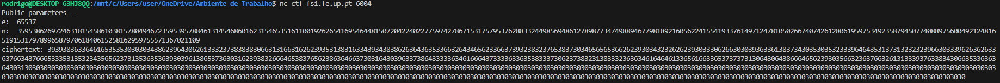
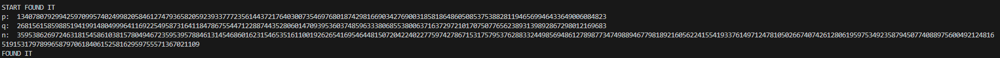
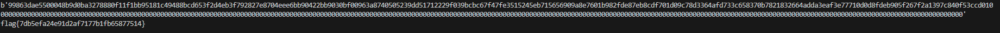

# CTF 11 RSA

## Setup

Antes de começarmos o ctf, precisamos de transferir um ficheiro (challenge.py) a partir do website CTF FSI 2023/2024, sendo as funções mais relevantes as seguintes:

```py

import os
import sys
import random
from binascii import hexlify, unhexlify


def enc(x, e, n):
    int_x = int.from_bytes(x, "little")
    y = pow(int_x,e,n)
    return hexlify(y.to_bytes(256, 'little'))

def dec(y, d, n):
    int_y = int.from_bytes(unhexlify(y), "little")
    x = pow(int_y,d,n)
    return x.to_bytes(256, 'little')

...
```
## Análise

No servidor, porta 6004, podemos encontrar o seguinte texto:



E obtemos os seguintes valores:
```py

e = 65537
n = 
359538626972463181545861038157804946723595395788461314546860162315465351611001926265416954644815072042240227759742786715317579537628833244985694861278987734749889467798189216056224155419337614971247810502667407426128061959753492358794507740889756004921248165191531797899658797061840615258162959755571367021109
ciphertext = 3939383633646165353530303034386239643062613332373838383066313166316262393531383163343934383862636436353366326434656233663739323832376538373034656565366262393034323262623930333062663030393633613837343035303532333964643531373132323239663033396263626336376634376665333531353234356562373135363536393039613865373630316239383266646538376562386364663730316430396337386433333634616664373333633635383337306237383231383332363634616464613365616633653737373130643064386664656239303566323637663261313339376338343066353363636430313030303030303030303030303030303030303030303030303030303030303030303030303030303030303030303030303030303030303030303030303030303030303030303030303030303030303030303030303030303030303030303030303030303030303030303030303030303030303030303030303030303030303030303030303030303030303030303030303030303030303030303030303030303030303030303030303030303030303030303030303030303030303030303030303030303030303030303030303030303030303030303030303030303030303030303030303030303030303030303030303030303030303030303030303030
```

Sabendo que os valores p (próximo de 2^512) e q (próximo de 2^513) são números primos usados para calcular o módulo n = p * q, temos de descobrir os valores dos mesmos.

## Exploit

Utilizamos o algoritmo Miller-Rabin para encontrar os números primos próximos:

```py
def is_prime(n):
    if n!=int(n):
        return False
    n=int(n)

    if n==0 or n==1 or n==4 or n==6 or n==8 or n==9:
        return False
        
    if n==2 or n==3 or n==5 or n==7:
        return True
    s = 0
    d = n-1
    while d%2==0:
        d>>=1
        s+=1
    assert(2**s * d == n-1)
  
    def trial_composite(a):
        if pow(a, d, n) == 1:
            return False
        for i in range(s):
            if pow(a, 2**i * d, n) == n-1:
                return False
        return True  
 
    for i in range(8):
        a = random.randrange(2, n)
        if trial_composite(a):
            return False
 
    return True

def getNext(number):

	while True:
		if is_prime(number):
			return number
		else:
			number += 1
```
Agora precisamos de fazer 2 whiles, para encontrar os valores corretos de p e q, tal que a sua multiplicação seja igual ao módulo:

```py

def getflag(p,q):
    bolen = True
    n = 359538626972463181545861038157804946723595395788461314546860162315465351611001926265416954644815072042240227759742786715317579537628833244985694861278987734749889467798189216056224155419337614971247810502667407426128061959753492358794507740889756004921248165191531797899658797061840615258162959755571367021109
    while(bolen):
        p_test = getNext(p)
        print("p: ",p_test)
        q = pow(2,513)
        while(True):
            q_test = getNext(q)
            n_test = p_test * q_test
            if(n_test == n):
                bolen = False
                print("START FOUND IT")
                print("p: ", p_test)
                print("q: ", q_test)
                print("n: ", n_test)
                print("FOUND IT")
                return p_test, q_test
                break
            elif(n_test > n):
                p = p_test + 1
                print("n_test is bigger than n")
                break
            else:
                q = q_test + 1 

```

Na qual serão os seguintes valores
```py
p=13407807929942597099574024998205846127479365820592393377723561443721764030073546976801874298166903427690031858186486050853753882811946569946433649006084823
q=26815615859885194199148049996411692254958731641184786755447122887443528060147093953603748596333806855380063716372972101707507765623893139892867298012169683
```


Após obtermos os valores de p e q, vamos proceder à sua desencriptação:

```py

(p,q)=getflag(pow(2,512),pow(2,513))
n = p*q
e = 65537
ciphertext = "3939383633646165353530303034386239643062613332373838383066313166316262393531383163343934383862636436353366326434656233663739323832376538373034656565366262393034323262623930333062663030393633613837343035303532333964643531373132323239663033396263626336376634376665333531353234356562373135363536393039613865373630316239383266646538376562386364663730316430396337386433333634616664373333633635383337306237383231383332363634616464613365616633653737373130643064386664656239303566323637663261313339376338343066353363636430313030303030303030303030303030303030303030303030303030303030303030303030303030303030303030303030303030303030303030303030303030303030303030303030303030303030303030303030303030303030303030303030303030303030303030303030303030303030303030303030303030303030303030303030303030303030303030303030303030303030303030303030303030303030303030303030303030303030303030303030303030303030303030303030303030303030303030303030303030303030303030303030303030303030303030303030303030303030303030303030303030303030303030303030303030"
# This line of code is to calculate the modular multiplicative inverse of e under the modulus (p-1)*(q-1)
d = pow(e, -1, ((p-1)*(q-1)))
ciphertext_hex = bytes.fromhex(ciphertext)
print(str(ciphertext_hex))
if len(ciphertext_hex) % 2 != 0:
    ciphertext_hex = '0' + ciphertext_hex  # Add a leading zero if the length is odd
flag = dec(ciphertext_hex, d, n)
print(flag.decode('utf-8'))
```

O que nos dá o seguinte resultado:

```
flag{7db5efa24e91d2af7177b1fb65877514}
```

