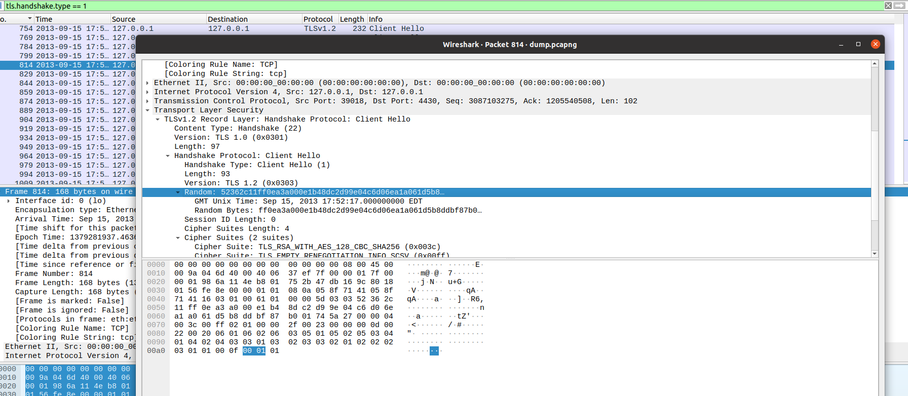
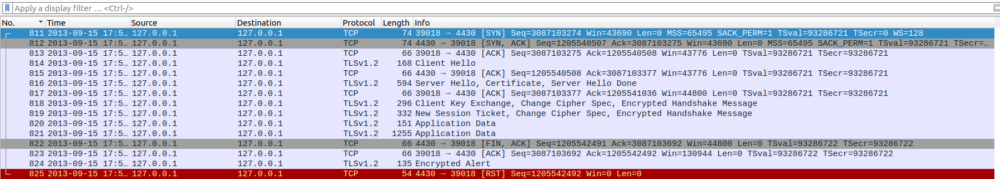
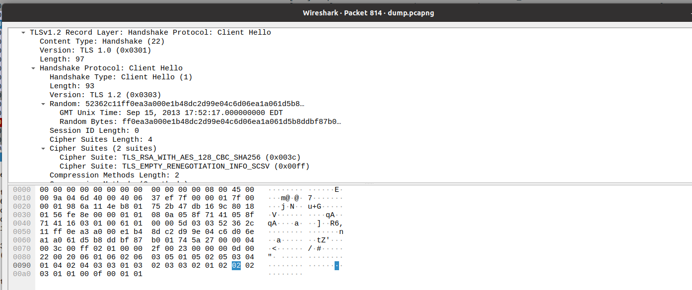
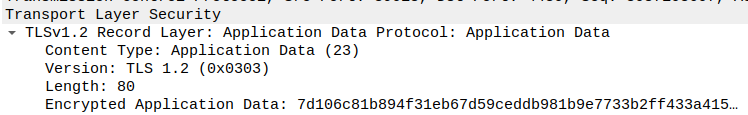
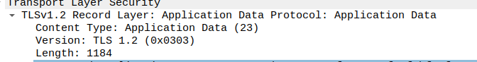
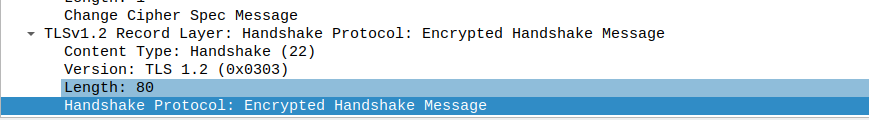

# CTF 11 Find-my-TLS

## Setup

Antes de iniciarmos o ctf, precisamos de instalar o software Wireshark e transferir o ficheiro dump.pcapng do servidor CTF FSI.

## Análise

Pelo enunciado, percebemos que tinhamos de encontrar o handshake na qual o valor random usado foi  `52362c11ff0ea3a000e1b48dc2d99e04c6d06ea1a061d5b8ddbf87b001745a27`.

Para tal abrimos o ficheiro com a aplicação wireshark e aplicamos um filtro `tls.handshake.type == 1`:



Como mostrado, encontramos o packet 814 que continha o valor random pedido. De seguida retiramos o filtro e procuramos o TCP correspondente ao pacote encontrado:



## Resolução

A primeira parte da flag corresponde a `<frame_start> e <frame_end> são o primeiro e último (respetivamente) números de frame correspondentes ao procedimento de handshake do TLS.`. Analisando, verificamos que correspondem a 814 e 819, pois os seguintes já são para comunicação de dados:

```txt
<frame_start> = 814
<frame_end> = 819
```

A segunda parte corresponde a `<selected_cipher_suite> é a ciphersuite escolhida para a conexão TLS (o nome, não o código)`. Abrindo o pacote 814, encontramos o seguinte:


Como podemos ver o cipher suite usado foi TLS_RSA_WITH_AES_128_CBC_SHA256:

```txt
<frame_start> = 814
<frame_end> = 819
<selected_cipher_suite> = TLS_RSA_WITH_AES_128_CBC_SHA256

```

De seguida, a próxima parte corresponde a
`<total_encrypted_appdata_exchanged> é a soma total do tamanho dos dados cifrados trocados neste canal, até à sua terminação.`. Para  obter os tamanhos dos dados cifrados , vamos aos packets 820 e 821, onde podemos encontrar os seguintes valores, respetivamente, 80 e 1184.


```txt
<frame_start> = 814
<frame_end> = 819
<selected_cipher_suite> = TLS_RSA_WITH_AES_128_CBC_SHA256
<total_encrypted_appdata_exchanged> 1264
```
Finalmente, a última parte corresponde a `<size_of_encrypted_message> é o tamanho da mensagem cifrada no handshake que concluí o procedimento de handshake` O tamanho é 80, pois verificamos no packet 818 e 819, pois são os únicos packets que contém Handshake Protocol: Encrypted Handshake message.



```
Packet Start 811

Packet Client Hello 

Packet End 825

TLS_RSA_WITH_AES_128_CBC_SHA256

Packet Data 820 length: 80
Packet Data 821 length: 1184

<frame_start> e <frame_end> 814 819
<selected_cipher_suite> TLS_RSA_WITH_AES_128_CBC_SHA256
<total_encrypted_appdata_exchanged> 1264
<size_of_encrypted_message> 80

52362c11ff0ea3a000e1b48dc2d99e04c6d06ea1a061d5b8ddbf87b001745a27

flag{814-819-TLS_RSA_WITH_AES_128_CBC_SHA256-1264-80}
```


