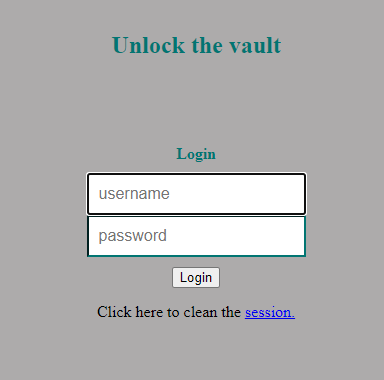
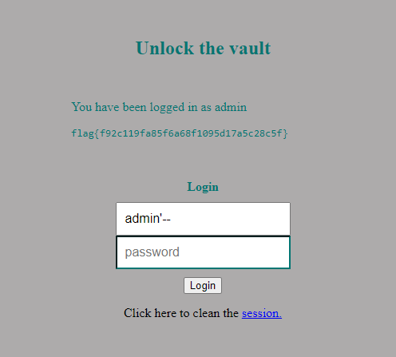

# CTF8 SQL Injection

## Setup

Antes de iniciarmos o desafio, tivemos de ativar a vpn e transferir o ficheiro index.php a partir do https://ctf-fsi.fe.up.pt/ , bem como o link do website para aplicarmos o nosso sql injection, que é http://ctf-fsi.fe.up.pt:5003/ .

## Análise

Para começarmos a fazer o desafio , decidimos começar por analisar o website e verificar se haveria alguma pista a partir do html, usando o inspect element. Não chegando a nenhuma conclusão além da existência de 2 input boxes, decidimos ir para o ficheiro transferido index.php .



Após analisar o ficheiro , apercebemo-nos que a base de dados é SQLite3 e que, tal como no Logbook desta semana, não existe sanitização dos inputs e que os comandos sql são construídos usando strings, podemos aplicar o mesmo método que aplicamos no Logbook.

```php
$username = $_POST['username'];
$password = $_POST['password'];
               
$query = "SELECT username FROM user WHERE username = '".$username."' AND password = '".$password."'";

//Chegamos à conclusão de que se tratava de SQLite3 através desta linha while ($data = $result->fetchArray(SQLITE3_ASSOC))
```

Para usar comentários no SQLite3 usamos o -- para fazer inline comments ou /* ... */ para multi-line comments.

Usando os nossos conhecimentos obtidos, vamos escrever o seguinte input, no username, `admin'--` e podemos colocar qualquer tipo de input na password (desde que não esteja vazio, pois é forçado `php placeholder = "password" required`).

O código em si seria do género:
```sql
SELECT username FROM user WHERE username = 'admin'--' AND password = ''
```


