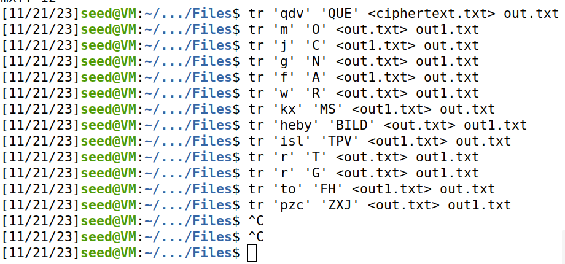
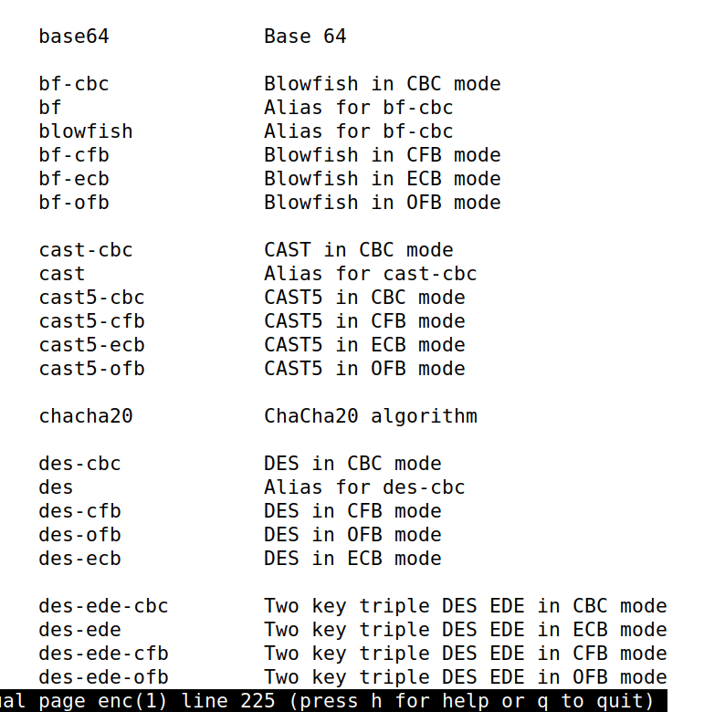
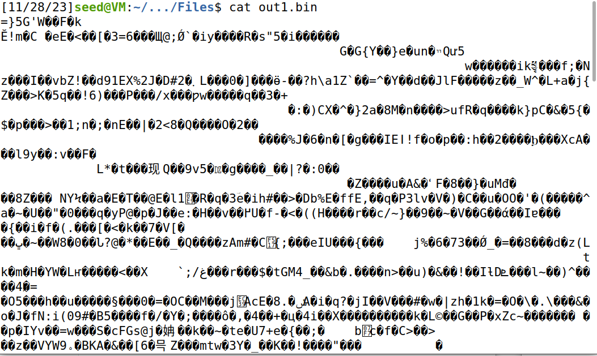

# LOGBOOK 10 Secret Key Encryption

## Setup

Antes de iniciarmos o guião, vamos entrar na seguinte pasta (seed-labs-master/category-crypto/Crypto_Encryption/Labsetup) e executar um terminal aí, na qual executamos os comandos `dcbuild` e `dcup` para executar os containers

## Task 1

Executando o comando ``./freq.py`:

```
-------------------------------------
1-gram (top 20):
f: 578
v: 578
m: 525
x: 385
w: 299
g: 237
e: 235
y: 198
d: 192
i: 192
k: 188
b: 111
j: 110
l: 106
s: 80
r: 63
q: 52
h: 39
t: 38
o: 30
-------------------------------------
2-gram (top 20):
mx: 108
fx: 79
wf: 73
fg: 73
yv: 70
ym: 67
vw: 66
iv: 61
dv: 60
vx: 59
yf: 56
gi: 56
mw: 56
vg: 55
fw: 53
qd: 52
ve: 47
im: 47
wv: 46
vk: 45
-------------------------------------
3-gram (top 20):
qdv: 40
lmx: 30
vgi: 28
fgy: 26
fgi: 22
giv: 22
Qdv: 19
gym: 19
gim: 18
lvw: 16
ifg: 15
wfg: 15
fym: 14
fwf: 14
xfx: 13
gyv: 13
mxx: 13
vxi: 13
wfk: 12
mxf: 12

```
Após uma análise muito profunda, utilizando as imagens fornecidas (unigram , bigram e trigram) e um bom conhecimento da poesia portuguesa, chegamos às seguintes conclusões :

```txt
a ->
b -> L
c -> J
d -> U
e -> I
f -> A
g -> N
h -> B
i -> T
j -> C
k -> M
l -> V
m -> O
n -> 
o -> H
p -> Z
q -> Q
r -> G
s -> P
t -> F
u -> 
v -> E
w -> R
x -> S
y -> D
z -> X
```



Ficando o resultado da seguinte maneira (Lusiadas de Camões):

```
AS ARMAS E OS BAROES ASSINALADOS
QUE DA OCIDENTAL PRAIA LUSITANA
POR MARES NUNCA DE ANTES NAVEGADOS
PASSARAM AINDA ALEM DA TAPROBANA
EM PERIGOS E GUERRAS ESFORCADOS
MAIS DO QUE PROMETIA A FORCA HUMANA
E ENTRE GENTE REMOTA EDIFICARAM
NOVO REINO QUE TANTO SUBLIMARAM

E TAMBEM AS MEMORIAS GLORIOSAS
DAQUELES REIS QUE FORAM DILATANDO
A FE O IMPERIO E AS TERRAS VICIOSAS
DE AFRICA E DE ASIA ANDARAM DEVASTANDO
E AQUELES QUE POR OBRAS VALEROSAS
SE VAO DA LEI DA MORTE LIBERTANDO
CANTANDO ESPALHAREI POR TODA PARTE
SE A TANTO ME AJUDAR O ENGENHO E ARTE

CESSEM DO SABIO GREGO E DO TROIANO
AS NAVEGACOES GRANDES QUE FIZERAM
CALESE DE ALEXANDRO E DE TRAJANO
A FAMA DAS VITORIAS QUE TIVERAM
QUE EU CANTO O PEITO ILUSTRE LUSITANO
A QUEM NEPTUNO E MARTE OBEDECERAM
CESSE TUDO O QUE A MUSA ANTIGA CANTA
QUE OUTRO VALOR MAIS ALTO SE ALEVANTA

E VOS TAGIDES MINHAS POIS CRIADO
TENDES EM MIM UM NOVO ENGENHO ARDENTE
SE SEMPRE EM VERSO HUMILDE CELEBRADO
FOI DE MIM VOSSO RIO ALEGREMENTE
DAIME AGORA UM SOM ALTO E SUBLIMADO
UM ESTILO GRANDILOQUO E CORRENTE
PORQUE DE VOSSAS AGUAS FEBO ORDENE
QUE NAO TENHAM INVEJA AS DE HIPOCRENE

DAIME UMA FURIA GRANDE E SONOROSA
E NAO DE AGRESTE AVENA OU FRAUTA RUDA
MAS DE TUBA CANORA E BELICOSA
QUE O PEITO ACENDE E A COR AO GESTO MUDA
DAIME IGUAL CANTO AOS FEITOS DA FAMOSA
GENTE VOSSA QUE A MARTE TANTO AJUDA
QUE SE ESPALHE E SE CANTE NO UNIVERSO
SE TAO SUBLIME PRECO CABE EM VERSO

E VOS O BEM NASCIDA SEGURANCA
DA LUSITANA ANTIGA LIBERDADE
E NAO MENOS CERTISSIMA ESPERANCA
DE AUMENTO DA PEQUENA CRISTANDADE
VOS O NOVO TEMOR DA MAURA LANCA
MARAVILHA FATAL DA NOSSA IDADE
DADA AO MUNDO POR DEUS QUE TODO O MANDE
PARA DO MUNDO A DEUS DAR PARTE GRANDE

VOS TENRO E NOVO RAMO FLORESCENTE
DE UMA ARVORE DE CRISTO MAIS AMADA
QUE NENHUMA NASCIDA NO OCIDENTE
CESAREA OU CRISTIANISSIMA CHAMADA
VEDEO NO VOSSO ESCUDO QUE PRESENTE
VOS AMOSTRA A VITORIA JA PASSADA
NA QUAL VOS DEU POR ARMAS E DEIXOU
AS QUE ELE PARA SI NA CRUZ TOMOU

VOS PODEROSO REI CUJO ALTO IMPERIO
O SOL LOGO EM NASCENDO VE PRIMEIRO
VEO TAMBEM NO MEIO DO HEMISFERIO
E QUANDO DESCE O DEIXA DERRADEIRO
VOS QUE ESPERAMOS JUGO E VITUPERIO
DO TORPE ISMAELITA CAVALEIRO
DO TURCO ORIENTAL E DO GENTIO
QUE INDA BEBE O LICOR DO SANTO RIO

INCLINAI POR UM POUCO A MAJESTADE
QUE NESSE TENRO GESTO VOS CONTEMPLO
QUE JA SE MOSTRA QUAL NA INTEIRA IDADE
QUANDO SUBINDO IREIS AO ETERNO TEMPLO
OS OLHOS DA REAL BENIGNIDADE
PONDE NO CHAO VEREIS UM NOVO EXEMPLO
DE AMOR DOS PATRIOS FEITOS VALEROSOS
EM VERSOS DIVULGADO NUMEROSOS

VEREIS AMOR DA PATRIA NAO MOVIDO
DE PREMIO VIL MAS ALTO E QUASE ETERNO
QUE NAO E PREMIO VIL SER CONHECIDO
POR UM PREGAO DO NINHO MEU PATERNO
OUVI VEREIS O NOME ENGRANDECIDO
DAQUELES DE QUEM SOIS SENHOR SUPERNO
E JULGAREIS QUAL E MAIS EXCELENTE
SE SER DO MUNDO REI SE DE TAL GENTE
 
OUVI QUE NAO VEREIS COM VAS FACANHAS
FANTASTICAS FINGIDAS MENTIROSAS
LOUVAR OS VOSSOS COMO NAS ESTRANHAS
MUSAS DE ENGRANDECERSE DESEJOSAS
AS VERDADEIRAS VOSSAS SAO TAMANHAS
QUE EXCEDEM AS SONHADAS FABULOSAS
QUE EXCEDEM RODAMONTE E O VAO RUGEIRO
E ORLANDO INDA QUE FORA VERDADEIRO

POR ESTES VOS DAREI UM NUNO FERO
QUE FEZ AO REI O AO REINO TAL SERVICO
UM EGAS E UM D FUAS QUE DE HOMERO
A CITARA PARA ELES SO COBICO
POIS PELOS DOZE PARES DARVOS QUERO
OS DOZE DE INGLATERRA E O SEU MAGRICO
DOUVOS TAMBEM AQUELE ILUSTRE GAMA
QUE PARA SI DE ENEIAS TOMA A FAMA

POIS SE A TROCO DE CARLOS REI DE FRANCA
OU DE CESAR QUEREIS IGUAL MEMORIA
VEDE O PRIMEIRO AFONSO CUJA LANCA
ESCURA FAZ QUALQUER ESTRANHA GLORIA
E AQUELE QUE A SEU REINO A SEGURANCA
DEIXOU COM A GRANDE E PROSPERA VITORIA
OUTRO JOANE INVICTO CAVALEIRO
O QUARTO E QUINTO AFONSOS E O TERCEIRO

NEM DEIXARAO MEUS VERSOS ESQUECIDOS
AQUELES QUE NOS REINOS LA DA AURORA
FIZERAM SO POR ARMAS TAO SUBIDOS
VOSSA BANDEIRA SEMPRE VENCEDORA
UM PACHECO FORTISSIMO E OS TEMIDOS
ALMEIDAS POR QUEM SEMPRE O TEJO CHORA
ALBUQUERQUE TERRIBIL CASTRO FORTE
E OUTROS EM QUEM PODER NAO TEVE A MORTE

E ENQUANTO EU ESTES CANTO E A VOS NAO POSSO
SUBLIME REI QUE NAO ME ATREVO A TANTO
TOMAI AS REDEAS VOS DO REINO VOSSO
DAREIS MATERIA A NUNCA OUVIDO CANTO
COMECEM A SENTIR O PESO GROSSO
QUE PELO MUNDO TODO FACA ESPANTO
DE EXERCITOS E FEITOS SINGULARES
DE AFRICA AS TERRAS E DO ORIENTE OS MARES

EM VOS OS OLHOS TEM O MOURO FRIO
EM QUEM VE SEU EXICIO AFIGURADO
SO COM VOS VER O BARBARO GENTIO
MOSTRA O PESCOCO AO JUGO JA INCLINADO
TETIS TODO O CERULEO SENHORIO
TEM PARA VOS POR DOTE APARELHADO
QUE AFEICOADA AO GESTO BELO E TENRO
DESEJA DE COMPRARVOS PARA GENRO

EM VOS SE VEM DA OLIMPICA MORADA
DOS DOIS AVOS AS ALMAS CA FAMOSAS
UMA NA PAZ ANGELICA DOURADA
OUTRA PELAS BATALHAS SANGUINOSAS
EM VOS ESPERAM VERSE RENOVADA
SUA MEMORIA E OBRAS VALEROSAS
E LA VOS TEM LUGAR NO FIM DA IDADE
NO TEMPLO DA SUPREMA ETERNIDADE

MAS ENQUANTO ESTE TEMPO PASSA LENTO
DE REGERDES OS POVOS QUE O DESEJAM
DAI VOS FAVOR AO NOVO ATREVIMENTO
PARA QUE ESTES MEUS VERSOS VOSSOS SEJAM
E VEREIS IR CORTANDO O SALSO ARGENTO
OS VOSSOS ARGONAUTAS POR QUE VEJAM
QUE SAO VISTOS DE VOS NO MAR IRADO
E COSTUMAIVOS JA A SER INVOCADO

JA NO LARGO OCEANO NAVEGAVAM
AS INQUIETAS ONDAS APARTANDO
OS VENTOS BRANDAMENTE RESPIRAVAM
DAS NAUS AS VELAS CONCAVAS INCHANDO
DA BRANCA ESCUMA OS MARES SE MOSTRAVAM
COBERTOS ONDE AS PROAS VAO CORTANDO
AS MARITIMAS AGUAS CONSAGRADAS
QUE DO GADO DE PROTEU SAO CORTADAS

QUANDO OS DEUSES NO OLIMPO LUMINOSO
ONDE O GOVERNO ESTA DA HUMANA GENTE
SE AJUNTAM EM CONCILIO GLORIOSO
SOBRE AS COUSAS FUTURAS DO ORIENTE
PISANDO O CRISTALINO CEU FORMOSO
VEM PELA VIALACTEA JUNTAMENTE
CONVOCADOS DA PARTE DO TONANTE
PELO NETO GENTIL DO VELHO ATLANTE
```

## Task 2

Usando `man enc`, conseguimos descobrir que tipo de cyphers são suportados :




Utilizamos os seguintes modos de encryptação:

```cmd
//1.  aes-128-cbc

openssl enc -aes-128-cbc -e -in out1.txt -out out1.bin -K 00112233445566778889aabbccddeeff -iv 0102030405060708

openssl enc -aes-128-cbc -d -in out1.bin -out out1_decrypt.txt -K 00112233445566778889aabbccddeeff -iv 0102030405060708


//2. bf-cbc

openssl enc -bf-cbc -e -in out1.txt -out out1.bin -K 00112233445566778889aabbccddeeff -iv 0102030405060708

openssl enc -bf-cbc -d -in out1.bin -out out1_decrypt.txt -K 00112233445566778889aabbccddeeff -iv 0102030405060708

//3.  cast-cbc

openssl enc -cast-cbc -e -in out1.txt -out out1.bin -K 00112233445566778889aabbccddeeff -iv 0102030405060708

openssl enc -cast-cbc -d -in out1.bin -out out1_decrypt.txt -K 00112233445566778889aabbccddeeff -iv 0102030405060708
```

Ao encriptarmos os 3 ficheiros, perdemos a abilidade de verificar a encriptação, mas ao desencriptá-los de volta, o texto desencriptado é igual ao texto original.

Também reparamos que se desencriptarmos com um modo diferente do que usamos para encriptar, dá o seguinte erro:

```
bad decrypt
140737347949888:error:06065064:digital envelope routines:EVP_DecryptFinal_ex:bad decrypt:crypto/evp/evp_enc.c:583:
```

## Task 3
