# LOGBOOK 8 Public-Key Infrastructure (PKI)
## Setup
- Começando o setup na pasta do lab, vamos mudar de pasta para "LabSetup" e executamos os códigos para dar build ao servidor local e para colocar o servidor a rodar, utilizando os seguintes códigos:

```shell
$ docker-compose build # Build the container image
$ docker-compose up # Start the container
```
 - Adicionamos o site gta6.com ao ficheiro hosts com este comando:

 ```shell
    sudo nano hosts # adicionamos a primeira linha 10.9.0.80 www.gta6.com
```
- Abrindo outro terminal, e depois executando o comando para saber os containers que estão a ser utilizados, dando o seguinte resultado:

```shell
$ dockps // Alias for: docker ps --format "{{.ID}} {{.Names}}"
```

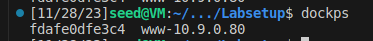

## Task 1
- Usando este código, nós copiamos a openssl.conf presente na presente em `/usr/lib/ssl/openssl.cnf` para a nossa folder atual que estou com o nome myopenssl.conf pois vamos realizar mudanças neste ficheiro para permitir a realização de tasks seguintes:

```shell
cp /usr/lib/ssl/openssl.cnf  myopenssl.cnf
```
- Para permitir criar certificados digitais nós descomentamos esta linha do ficheiro `unique_subject	=   no`, ficando com o ficheiro da seguinte maneira
```
[ CA_default ]

dir		= ./demoCA		# Where everything is kept
certs		= $dir/certs		# Where the issued certs are kept
crl_dir		= $dir/crl		# Where the issued crl are kept
database	= $dir/index.txt	# database index file.
unique_subject	= no			# Set to 'no' to allow creation of
```
 - Também criamos uma pasta onde colocamos tudo o que criamos, dentro de um ficheiro vazio chamado index.txt e um ficheiro com o número de série 1000.
- Agora, para criar uma Autoridade de Certificação (CA), executamos este código:
```
openssl req -x509 -newkey rsa:4096 -sha256 -days 3650 \
-keyout ca.key -out ca.crt

```
 - Preenchemos o certificado com os seguintes dados:
 ```
 PEM Pass Phrase : 1234
 Country: Pt
 State: Mirandela
 City: Mirandela
 Organization: Mira-papel
 Unit: Mira_1
 Name: MiraCorps
 Email: Mira@example.com
 
 ```
- Com este comando, podemos visualizar as informações da chave pública `openssl x509 -in ca.crt -text -noout` e ao utilizar este código `openssl rsa -in ca.key -text -noout`, podemos examinar a chave privada RSA. Ao analisarmos ambas as saídas, podemos inferir algumas conclusões.

- Através deste output podemos saber que é um AC válido 'CA: TRUE'

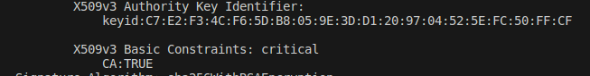

- Sabemos que este certificado foi utilizado por si próprio,porque tanto o signature algorithm como o subject são 
os mesmos.

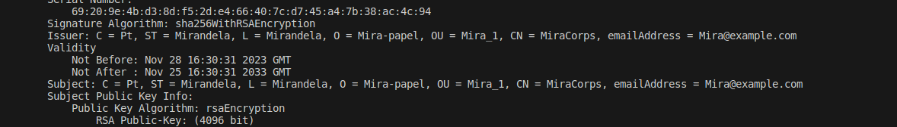

- Verificando o ficheiro rsa, obtivemos os seguintes dados:

- The public expoent is

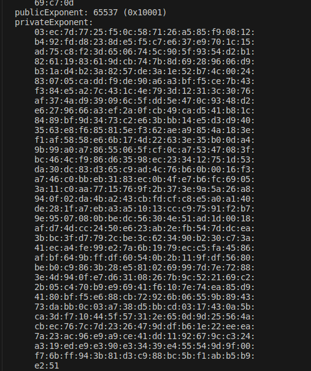

- The private expoent

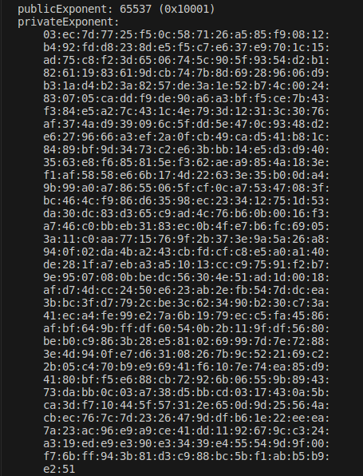

- The modulus 

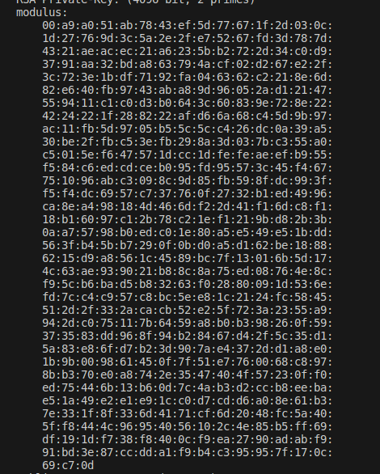

- The two numbers prime

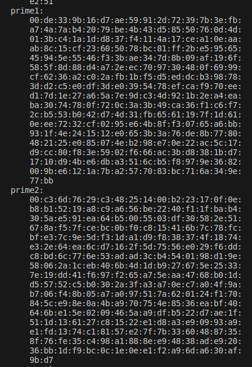

## Task 2
 - Para gerar um csr (certificate signing request) para o site gta6.com, usamos este comando:
```
openssl req -newkey rsa:2048 -sha256 \
-keyout server.key -out server.csr \
-subj "/CN=www.gta6.com/O=Gta6 Inc./C=US" \
-passout pass:1234 -addext "subjectAltName = DNS:www.gta6.com, \
DNS:www.gta6A.com, \
DNS:www.gta6B.com"
```
 - Nós geramos um par de chaves públicas e privadas. para as aceder executamos os códigos seguintes 

 - Para ver a chave privada usamos:
 ```
 openssl req -in server.csr -text -noout
 ```


 - Para ver a chave pública usamos:
 ```
 openssl rsa -in server.key -text -noout
 ```
 - Que nos dá este output
 ```
 Enter pass phrase for server.key:
RSA Private-Key: (2048 bit, 2 primes)
modulus:
    00:93:b8:b7:6c:b3:7b:41:53:25:58:89:80:93:fc:
    68:c3:57:3a:e4:81:8d:f4:2b:eb:f3:fe:b5:b9:4c:
    5c:1a:5a:01:2e:0a:53:65:55:21:dc:4e:be:a7:9c:
    e6:01:55:47:a5:59:40:7f:da:d9:f7:36:53:32:47:
    ac:c5:26:64:17:95:7e:d3:86:d8:1b:c8:8e:41:2f:
    b8:0b:e8:4b:18:d9:f9:2f:aa:da:77:58:ea:b2:b8:
    6a:a8:c2:5d:5f:38:9b:45:da:14:35:fe:2c:df:f3:
    73:db:27:10:66:c2:1b:de:9c:0d:0a:c7:93:25:65:
    93:fd:4e:42:29:03:90:49:c9:8a:26:1a:77:f1:3d:
    9a:01:d0:74:08:c0:fa:bd:52:a0:df:fd:7c:21:80:
    02:8e:2e:fd:4f:46:3b:97:84:4a:74:5f:08:ba:35:
    54:0d:ef:0b:98:8d:85:39:b6:ec:ed:ed:b3:91:3b:
    9d:c9:cb:76:c5:b0:93:b4:2b:cb:83:ef:e5:93:45:
    0c:cd:28:c8:24:78:a5:72:2d:5a:07:c1:4b:a2:81:
    60:d7:75:ac:52:71:a7:7f:cb:8e:9f:12:25:25:db:
    b3:30:cd:fa:1d:31:fe:33:39:68:18:1c:b5:40:7a:
    9c:4f:9b:66:30:e0:68:f8:03:04:ec:3f:69:fb:80:
    b3:bb
publicExponent: 65537 (0x10001)
privateExponent:
    2f:c0:59:42:c1:2e:09:aa:d7:fa:ab:d0:2d:86:3d:
    53:4f:e2:50:b5:74:6e:c6:b7:ea:52:9e:e9:bc:3e:
    55:a2:5c:99:46:6b:38:e9:71:1d:a7:32:c8:39:d6:
    bb:fd:96:40:63:fe:8e:95:ef:39:93:8d:07:46:d6:
    19:90:d4:70:2f:3a:25:24:84:bd:4e:72:75:ad:f8:
    3f:99:22:95:70:f8:b5:28:f4:9f:f9:d5:3c:5a:92:
    d7:e4:a4:8c:40:5f:29:10:5a:d2:2d:4c:d2:43:ff:
    62:8b:59:28:ee:7c:55:d4:79:fe:cf:0e:c8:da:f2:
    20:c2:e8:6e:1b:a1:cb:c7:e5:af:39:99:3d:c8:23:
    42:39:a9:b8:8b:16:cc:2b:fb:bc:ba:85:27:91:dc:
    3f:66:1c:07:73:1f:d6:19:e0:4a:c5:c2:cb:e1:fe:
    e2:bb:49:dd:57:fe:97:58:82:65:1e:44:15:fb:d3:
    1e:b2:36:cb:8d:52:49:e1:21:71:e8:6a:30:1a:73:
    67:23:5b:1e:7a:9b:c4:3e:01:62:da:03:6c:ec:0a:
    2d:10:22:6b:f6:8e:92:13:23:39:48:9a:08:d9:1e:
    e7:26:17:72:f5:e9:1e:a9:bf:35:2b:55:b8:14:5e:
    94:cf:87:d8:e4:d0:75:64:1a:be:d1:d3:8f:86:e9:
    51
prime1:
    00:c3:c5:ee:92:e9:e1:a9:84:86:8b:c5:d2:83:af:
    64:b4:97:05:4f:b7:62:e8:91:66:a0:8d:06:a9:9e:
    34:6a:fc:bd:a0:bb:87:c9:8c:da:30:49:6f:ed:3a:
    71:e0:3a:cd:24:ab:2b:cf:24:50:5d:6b:6a:ea:45:
    e9:d4:bd:4b:20:8c:6e:27:7a:bf:ff:bf:fb:9f:a2:
    56:0e:f3:7a:53:00:2c:d9:32:b0:db:d8:8a:1f:36:
    07:08:b5:e9:09:17:f8:1d:97:47:8c:7a:b0:9f:ab:
    aa:de:e4:42:ec:5f:8a:25:4b:be:dc:83:c4:f7:c7:
    46:ba:ab:4d:53:c1:60:56:c3
prime2:
    00:c1:2a:7d:a6:45:96:57:4b:be:c2:aa:62:96:a0:
    76:7f:69:56:e3:b4:30:44:db:c0:b2:26:59:ba:89:
    86:b4:98:f2:0c:51:52:b2:37:32:99:af:67:1d:1c:
    51:89:18:dd:dd:30:23:4c:28:27:47:40:25:22:32:
    2b:bc:ce:f5:89:bf:92:7e:7d:ea:29:cd:c7:9d:49:
    71:fc:3e:a9:c4:4f:a2:34:6b:73:56:88:ff:64:51:
    87:75:7b:c7:33:74:a0:1f:4e:53:89:04:3c:8f:d6:
    65:01:35:c0:e1:80:3a:d5:85:a4:7b:f1:91:38:89:
    ba:3f:07:4f:5e:f1:c6:0f:a9
exponent1:
    49:eb:2d:36:69:7a:9c:0f:fe:e1:3d:93:4b:c7:68:
    c5:cb:13:e5:52:7f:d5:02:39:76:bb:68:dd:98:6f:
    80:49:e7:ab:8d:c3:2a:75:b5:58:70:12:03:c7:82:
    81:c0:91:fe:9b:66:d2:32:8a:e9:8b:0a:76:64:69:
    72:ba:fa:67:d2:be:30:c7:e7:40:c0:93:58:65:ea:
    0a:81:22:19:be:c2:30:4c:34:7c:fd:d8:c1:0a:1c:
    43:cc:b3:ad:8c:50:51:93:f2:1e:f7:a0:42:d9:85:
    8d:dd:2f:eb:a1:f3:3e:3b:c8:57:e8:a4:f1:4d:5b:
    c6:55:b1:bf:c3:0f:06:13
exponent2:
    4e:87:4a:ab:94:f0:a8:ae:97:6f:a6:3b:0c:47:51:
    c5:3c:7a:e1:79:38:82:55:e0:41:cc:8b:7f:e5:37:
    09:26:80:88:77:6b:2a:1e:7c:88:b4:21:34:59:75:
    e0:49:66:b0:ec:47:fd:46:f9:a8:e2:af:f5:f5:f5:
    87:fd:8f:1e:9f:ee:1b:54:6f:24:ed:8e:70:28:12:
    99:dc:93:c1:c6:2a:08:2b:82:a9:34:6a:b7:4a:d9:
    c9:ee:37:2e:79:04:3b:95:e9:29:f3:b9:f7:33:ce:
    be:2e:2f:2a:bd:a9:ad:72:76:4b:19:0a:d3:b4:52:
    2e:1b:77:ad:fe:96:69:79
coefficient:
    00:b6:33:ca:a0:4c:90:06:22:5e:2f:f5:3b:94:4f:
    cf:40:89:ea:3b:22:47:58:fd:3b:2a:93:c9:29:c5:
    b9:29:37:1c:83:4e:a5:54:78:56:fc:8d:4a:8d:5c:
    47:3b:bf:94:0d:cd:7f:e0:ae:28:c0:08:83:8f:37:
    a5:fb:3f:0c:13:b8:0e:72:74:d0:e7:d6:44:e2:7f:
    74:36:a1:47:61:cb:91:34:c2:f9:e2:d2:8a:92:69:
    49:9a:c0:95:58:2c:0d:06:14:82:4b:67:30:ba:cb:
    3c:79:f3:28:e6:64:d5:ef:d3:63:76:01:7f:a4:8a:
    ee:7c:1b:42:8f:cd:19:90:9f
 ```

## Task 3

 - Utilizamos este código para executar o nosso ficheiro myopenssl.cnf.
 ```
 openssl ca -config myopenssl.cnf -policy policy_anything -md sha256 -days 3650 -in server.csr -out server.crt -batch -cert ca.crt -keyfile ca.key
 ```
- Descomentamos esta linha de código no ficheiro myopen.cnf para permitir a cópia de extensões.
```openssl
# Extension copying option: use with caution.
copy_extensions = copy
```
 - Recebemos um output:
```
....
            X509v3 Subject Alternative Name: 
                DNS:www.gta6.com, DNS:www.gta6A.com, DNS:www.gta6B.com
....
```

## Task 4
- Modificamos o bank32_apache_ssl.conf para que o certificado e chave usados sejam os da pasta partilhada:
```
<VirtualHost *:443> 
    DocumentRoot /var/www/gta6
    ServerName www.gta6.com
    ServerAlias www.gta6A.com
    ServerAlias www.gta6B.com
    DirectoryIndex index.html
    SSLEngine On 
    SSLCertificateFile /volumes/gta6.crt
    SSLCertificateKeyFile /volumes/gta6.key
</VirtualHost>

```

- Este é o dockerfile:

```
FROM handsonsecurity/seed-server:apache-php

ARG WWWDIR=/var/www/gta6

COPY ./index.html ./index_red.html $WWWDIR/
COPY ./gta6_apache_ssl.conf /etc/apache2/sites-available
COPY ./certs/bank32.crt ./certs/bank32.key  /certs/

RUN  chmod 400 /certs/bank32.key \
     && chmod 644 $WWWDIR/index.html \
     && chmod 644 $WWWDIR/index_red.html \
     && a2ensite gta6_apache_ssl   

CMD  tail -f /dev/null


```

 -Então, utilizamos os comandos do Docker para anexar um terminal (shell) ao container Docker.
```bash

[12/10/23]seed@VM:~/.../volumes$ dockps
26d340a3fb58  www-10.9.0.80
[12/10/23]seed@VM:~/.../volumes$ dockpsh 26
dockpsh: command not found
[12/10/23]seed@VM:~/.../volumes$ docksh 26

```
 - Em seguida, iniciamos o servidor no terminal do Docker e inserimos a palavra-passe quando solicitado.
 ```bash

  root@26d340a3fb58:/# service apache2 start
 * Starting Apache httpd web server apache2                                                                                                                    Enter passphrase for SSL/TLS keys for www.gta6.com:443 (RSA):
 * 
 
 ```
- Quando acedemos ao site, recebemos isto:


 - Agora que removi a execução permanente do navegador para que este verifique novamente o certificado:
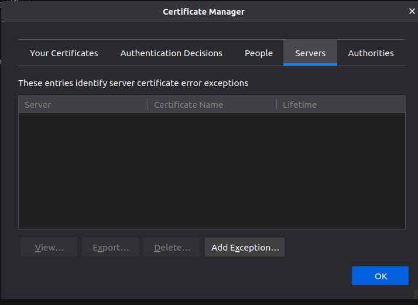

 - Importámos o certificado da CA para o navegador e agora temos uma ligação segura.

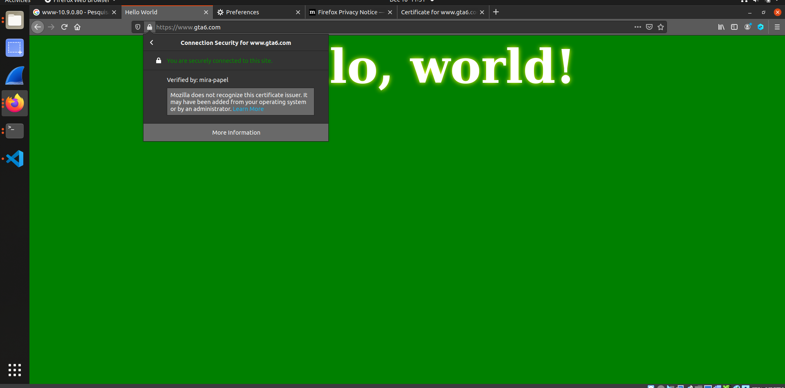

## Task5
- Mudamos o ficheiro antigo gta6_apache_ssl.conf para estar assim
```
<VirtualHost *:443> 
    DocumentRoot /var/www/gta6
    ServerName www.example.com,
    ServerAlias www.gta6A.com
    ServerAlias www.gta6B.com
    DirectoryIndex index.html
    SSLEngine On 
    SSLCertificateFile /volumes/gta6.crt
    SSLCertificateKeyFile /volumes/gta6.key
</VirtualHost>

```
- Executamos:
```
sudo nano  hosts # mudamos a primeira entrada para 10.9.0.80 www.example.com

```
- Quando acedemos ao site, dá este warning

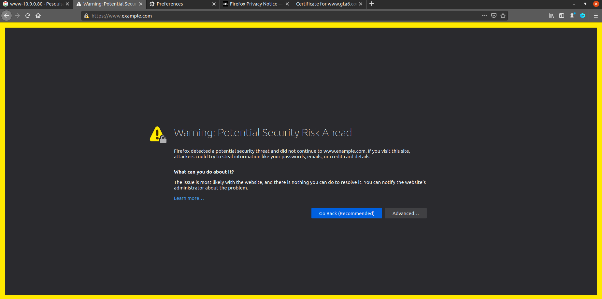

 - Avançamos e continua assim podemos ver que o site é inseguro porque o domínio do website não coincide com o domínio do certificado

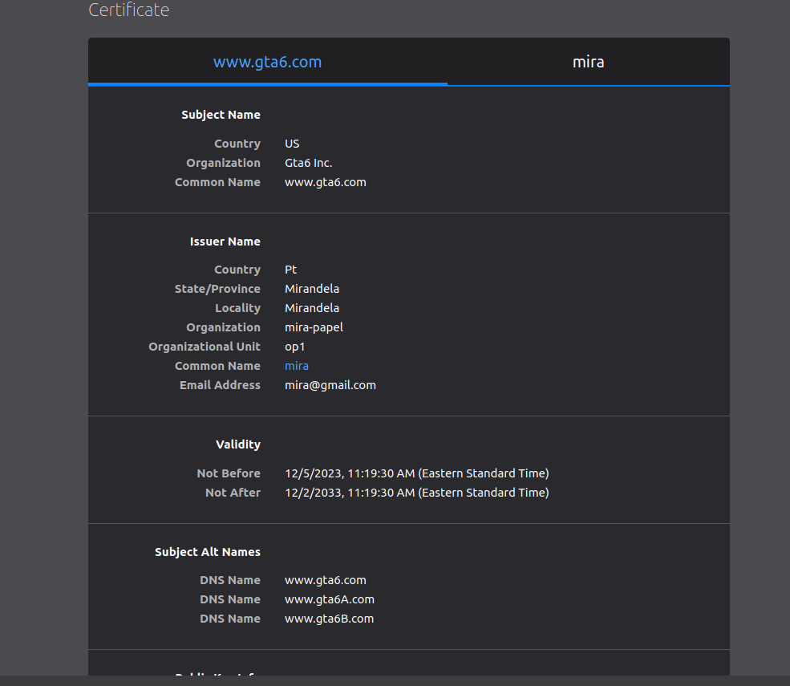
 

## Task 6 

- Se o Ca estiver comprometido nós podemos utilizá-lo para criar criar certificados para um site malicioso. Para fazer isso, nós utilizamos o código da tarefa2 e da tarefa3 com as diferenças do domínio:
```
openssl req -newkey rsa:2048 -sha256 \
-keyout example.key -out example.csr \
-subj "/CN=www.example.com/O=example Inc./C=US" \
-passout pass:1234

 openssl ca -config myopenssl.cnf -policy policy_anything -md sha256 -days 3650 -in example.csr -out example.crt -batch -cert ca.crt -keyfile ca.key

```
 - Colocamos os certificados novos do site na pasta volumes e alteramos o gta6_apache_ssl.conf para:

 ```
 <VirtualHost *:443> 
    DocumentRoot /var/www/gta6
    ServerName www.example.com,
    ServerAlias www.gta6A.com
    ServerAlias www.gta6B.com
    DirectoryIndex index.html
    SSLEngine On 
    SSLCertificateFile /volumes/example.crt
    SSLCertificateKeyFile /volumes/example.key
</VirtualHost>
 ```
 - Assim esta o site sem erros de segurança.
 
 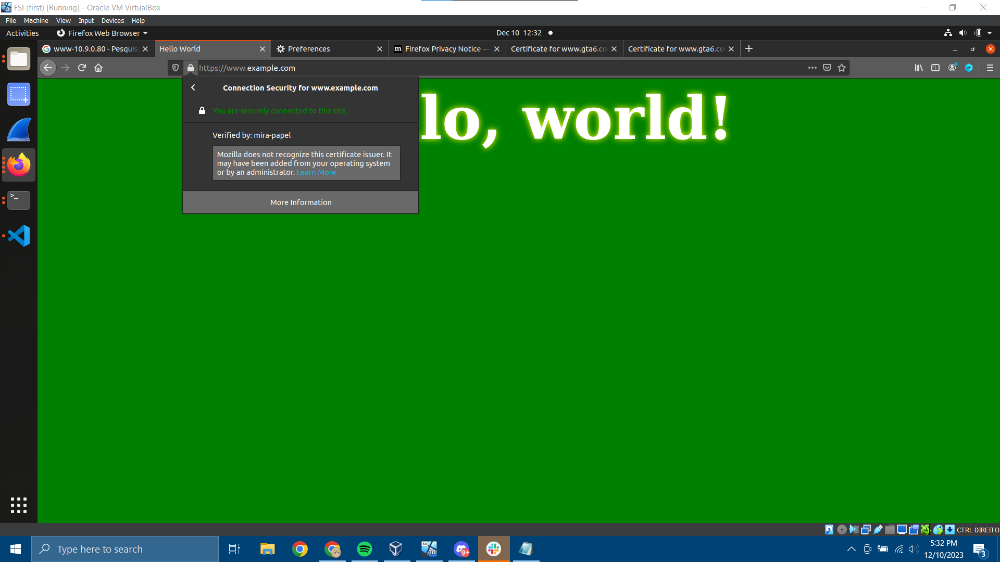
