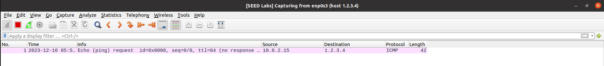
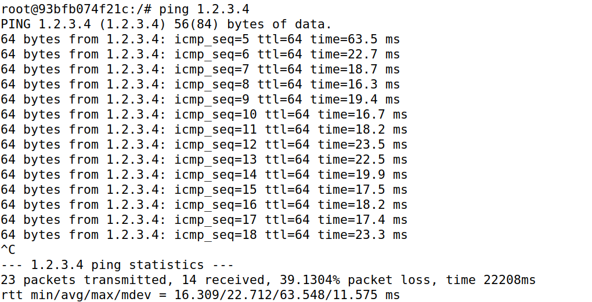
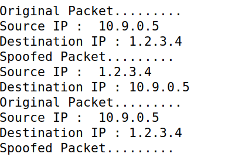
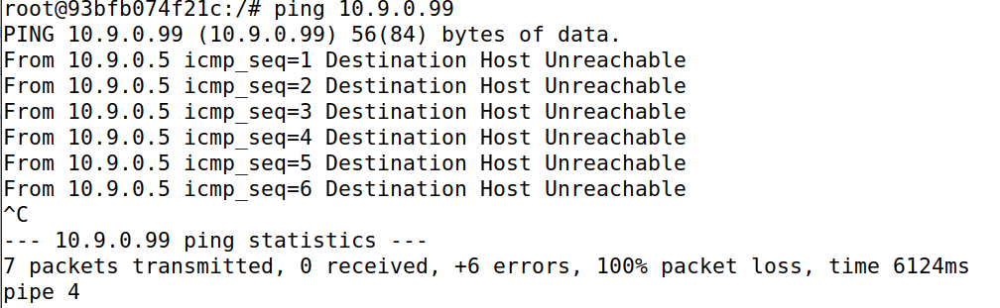
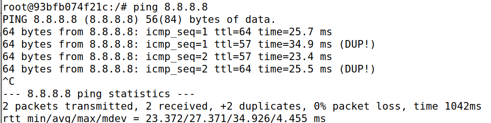

# LOGBOOK13 Sniffing and Spoofing
## Setup

Antes de começarmos o lab, precisamos de dar setup aos containers necessários para o guião:

```bash
dcbuild
dcup
```

Precisamos encontrar o nome da interface de rede correspondente na nossa máquina virtual, pois precisamos utilizá-la nos nossos programas:

```
[12/12/23]seed@VM:~/.../Labsetup$ ifconfig
br-1f43b629af2f: flags=4163<UP,BROADCAST,RUNNING,MULTICAST>  mtu 1500
        inet 10.9.0.1  netmask 255.255.255.0  broadcast 10.9.0.255
        inet6 fe80::42:c4ff:fe69:d216  prefixlen 64  scopeid 0x20<link>
        ether 02:42:c4:69:d2:16  txqueuelen 0  (Ethernet)
        RX packets 148  bytes 7488 (7.4 KB)
        RX errors 0  dropped 0  overruns 0  frame 0
        TX packets 312  bytes 57909 (57.9 KB)
        TX errors 0  dropped 0 overruns 0  carrier 0  collisions 0
```

## Task1.1A

Em cada terminal abrimos um shell para cada container:

```bash
[12/12/23]seed@VM:~/.../Labsetup$ dockps
323fb46ae1c0  hostB-10.9.0.6
93bfb074f21c  hostA-10.9.0.5
112fbb9ad809  seed-attacker

#Terminal host
docksh seed-attacker

#Terminal hostA
docksh 93b

#Terminal hostB
docksh 323
```

De seguida, criamos um ficheiro python no folder volumes, que contém o seguinte código:

```py
#!/usr/bin/env python3
from scapy.all import *
def print_pkt(pkt):
	pkt.show()
pkt = sniff(iface='br-1f43b629af2f', filter='icmp', prn=print_pkt)

```

Agora vamos dar permissões de executable ao programa e corre-lo com root privilege, usando a linha `chmod a+x sniffer.py`.

Antes de executar o sniffer.py, vamos executar o comando `ping 10.9.0.6` , na qual o hostA vai 'pingar' o hostB.

Vamos executar o sniffer.py no seed-attacker e vamos obter os seguintes resultados (ter em conta que isto é apenas uma porção pequena de resultados):

```
###[ Ethernet ]### 
  dst       = 02:42:0a:09:00:06
  src       = 02:42:0a:09:00:05
  type      = IPv4
###[ IP ]### 
     version   = 4
     ihl       = 5
     tos       = 0x0
     len       = 84
     id        = 35943
     flags     = DF
     frag      = 0
     ttl       = 64
     proto     = icmp
     chksum    = 0x9a25
     src       = 10.9.0.5
     dst       = 10.9.0.6
     \options   \
###[ ICMP ]### 
        type      = echo-request
        code      = 0
        chksum    = 0xde0b
        id        = 0x1e
        seq       = 0x1
###[ Raw ]### 
           load      = '\xef\x88xe\x00\x00\x00\x00\xeb\x13\x08\x00\x00\x00\x00\x00\x10\x11\x12\x13\x14\x15\x16\x17\x18\x19\x1a\x1b\x1c\x1d\x1e\x1f !"#$%&\'()*+,-./01234567'

```

Agora, vamos tentar executar sem privilégios root:
```bash
./sniffer.py
Traceback (most recent call last):
  File "./sniffer.py", line 5, in <module>
    pkt = sniff(iface='br-1f43b629af2f', filter='icmp', prn=print_pkt)
  File "/usr/local/lib/python3.8/dist-packages/scapy/sendrecv.py", line 1036, in sniff
    sniffer._run(*args, **kwargs)
  File "/usr/local/lib/python3.8/dist-packages/scapy/sendrecv.py", line 906, in _run
    sniff_sockets[L2socket(type=ETH_P_ALL, iface=iface,
  File "/usr/local/lib/python3.8/dist-packages/scapy/arch/linux.py", line 398, in __init__
    self.ins = socket.socket(socket.AF_PACKET, socket.SOCK_RAW, socket.htons(type))  # noqa: E501
  File "/usr/lib/python3.8/socket.py", line 231, in __init__
    _socket.socket.__init__(self, family, type, proto, fileno)
PermissionError: [Errno 1] Operation not permitted
```

Quando é executado sem privilégios de root, o programa não possui as permissões necessárias para aceder à interface de rede e, por conseguinte, não consegue capturar pacotes com sucesso.

## Task 1.1B

Para o primeiro, Capture only the ICMP packet, este já está feito, como demonstrado anteriormente:

Para o segundo, trocamos:

```py

pkt = sniff(iface='br-1f43b629af2f', filter='icmp', prn=print_pkt)

#por

pkt = sniff(iface='br-1f43b629af2f', filter='tcp && src host 10.9.0.5 && dst port 23', prn=print_pkt)

```

Executando o código sniffer.py no root e executando `telnet 10.9.0.5` no hostb, obtemos o seguinte:

```bash
###[ Ethernet ]### 
  dst       = 02:42:0a:09:00:05
  src       = 02:42:0a:09:00:06
  type      = IPv4
###[ IP ]### 
     version   = 4
     ihl       = 5
     tos       = 0x10
     len       = 53
     id        = 29606
     flags     = DF
     frag      = 0
     ttl       = 64
     proto     = tcp
     chksum    = 0xb2f0
     src       = 10.9.0.6
     dst       = 10.9.0.5
     \options   \
###[ TCP ]### 
        sport     = 52896
        dport     = telnet
        seq       = 1736457029
        ack       = 2168824586
        dataofs   = 8
        reserved  = 0
        flags     = PA
        window    = 501
        chksum    = 0x1444
        urgptr    = 0
        options   = [('NOP', None), ('NOP', None), ('Timestamp', (2059425372, 2968017436))]
###[ Raw ]### 
           load      = '\x03'
```

Relembrar que o port 23 corresponde a telnet.

Para o terceiro, trocamos por:

```bash
pkt = sniff(iface='br-1f43b629af2f', filter= 'net 128.230.0.0/16', prn = print_pkt)
```
Na qual obtemos o seguinte, se executarmos novamente o ficheiro sniffer.py no root e fizermos ping 128.230.0.11:

```bash
###[ Ethernet ]### 
  dst       = 02:42:9f:67:93:fe
  src       = 02:42:0a:09:00:06
  type      = IPv4
###[ IP ]### 
     version   = 4
     ihl       = 5
     tos       = 0x0
     len       = 84
     id        = 466
     flags     = DF
     frag      = 0
     ttl       = 64
     proto     = icmp
     chksum    = 0xadd7
     src       = 10.9.0.6
     dst       = 128.230.0.11
     \options   \
###[ ICMP ]### 
        type      = echo-request
        code      = 0
        chksum    = 0xab2f
        id        = 0x1e
        seq       = 0x7
###[ Raw ]### 
           load      = '\x8e\xe6|e\x00\x00\x00\x00~\x8c\x04\x00\x00\x00\x00\x00\x10\x11\x12\x13\x14\x15\x16\x17\x18\x19\x1a\x1b\x1c\x1d\x1e\x1f !"#$%&'()*+,-./01234567'
```
## Task 1.2

Criamos um ficheiro task2.py que contém o seguinte código:

```py
from scapy.all import *
a = IP()
a.dst = '10.0.2.3'
b = ICMP()
p = a/b
send(p)

ls(a)
```
Mudamos o a.dst para `1.2.3.4` e o send(p) para `send(p,iface='br-1f43b629af2f')`. Após isso, abrimos  wireshark e começamos a procurar a interface que tivesse o `10.0.2.15` , que no nosso caso foi o `enp0s3` e começamos a capturar. Executamos o código python e obtivemos o seguinte:



## Task 1.3

Criamos um ficheiro task3.py que contém o seguinte código, para automatizar o processo do ttl:

```py
#!/usr/bin/env python3
from scapy.all import *
import sys
a = IP()
a.dst = '1.2.3.4'
a.ttl = int(sys.argv[1])
b = ICMP()
#a variant that only returns on packet that answered the packet that was sent
c = sr1(a/b)
print("Source:", c.src)
```

Estivemos a experimemtar com o dst = 1.2.3.4, mas não estavamos a ter sucesso, e chegamos à conclusão de que seria por ser um host não existente. Por isso decidimos mudar para um host que existe, por exemplo `8.8.8.8 ou 8.8.4.4`

Agora conseguimos observar os resultados:
```
Received 1 packets, got 0 answers, remaining 1 packets
Source: 10.0.2.15
root@VM:/volumes# ./task3.py 1
Begin emission:
Finished sending 1 packets.
.*
Received 2 packets, got 1 answers, remaining 0 packets
Source: 10.0.2.2
root@VM:/volumes# ./task3.py 2
Begin emission:
Finished sending 1 packets.
.*
Received 2 packets, got 1 answers, remaining 0 packets
Source: 192.168.1.1
root@VM:/volumes# ./task3.py 3
Begin emission:
Finished sending 1 packets.
.


^C
Received 1 packets, got 0 answers, remaining 1 packets
Traceback (most recent call last):
  File "./task3.py", line 9, in <module>
    print("Source:", c.src)
AttributeError: 'NoneType' object has no attribute 'src'
root@VM:/volumes# ./task3.py 4
Begin emission:
Finished sending 1 packets.
.*
Received 2 packets, got 1 answers, remaining 0 packets
Source: 10.137.232.41
root@VM:/volumes# ./task3.py 5
Begin emission:
Finished sending 1 packets.
.*
Received 2 packets, got 1 answers, remaining 0 packets
Source: 10.255.48.86
root@VM:/volumes# ./task3.py 6
Begin emission:
Finished sending 1 packets.
.*
Received 2 packets, got 1 answers, remaining 0 packets
Source: 142.250.165.124
root@VM:/volumes# ./task3.py 7
Begin emission:
Finished sending 1 packets.
.*
Received 2 packets, got 1 answers, remaining 0 packets
Source: 172.253.67.17
root@VM:/volumes# ./task3.py 8
Begin emission:
Finished sending 1 packets.
.*
Received 2 packets, got 1 answers, remaining 0 packets
Source: 192.178.81.220
root@VM:/volumes# ./task3.py 9
Begin emission:
Finished sending 1 packets.
.*
Received 2 packets, got 1 answers, remaining 0 packets
Source: 142.250.237.82
root@VM:/volumes# ./task3.py 10
Begin emission:
Finished sending 1 packets.
.*
Received 2 packets, got 1 answers, remaining 0 packets
Source: 142.251.55.151
root@VM:/volumes# ./task3.py 11
Begin emission:
Finished sending 1 packets.
.*
Received 2 packets, got 1 answers, remaining 0 packets
Source: 74.125.242.177
root@VM:/volumes# ./task3.py 12
Begin emission:
Finished sending 1 packets.
.*
Received 2 packets, got 1 answers, remaining 0 packets
Source: 142.250.46.167
root@VM:/volumes# ./task3.py 13
Begin emission:
Finished sending 1 packets.
.*
Received 2 packets, got 1 answers, remaining 0 packets
Source: 8.8.4.4
```

Reparamos que o valor TTL num pacote IP determina quantos saltos (routers) o pacote pode fazer antes de ser descartado. À medida que o valor TTL diminui, o pacote pode passar por menos routers antes de expirar. Quando o TTL se torna 0, o pacote é descartado, e pode ser enviada uma mensagem ICMP "Tempo Excedido" pelo último router que lidou com o pacote, que neste caso foi quando o valor ttl era 13 e fomos para o source 8.8.4.4

## Task 1.4

Criamos um ficheiro task4.py que faz o que nos pede:

```py

#!/usr/bin/env python3
from scapy.all import *
def spoof_pkt(pkt):
    # sniff and print out icmp echo request packet
    if ICMP in pkt and pkt[ICMP].type == 8:
        print("Original Packet.........")
        print("Source IP : ", pkt[IP].src)
        print("Destination IP :", pkt[IP].dst)

        # spoof an icmp echo reply packet
        # swap srcip and dstip
        ip = IP(src=pkt[IP].dst, dst=pkt[IP].src, ihl=pkt[IP].ihl)
        icmp = ICMP(type=0, id=pkt[ICMP].id, seq=pkt[ICMP].seq)
        data = pkt[Raw].load
        newpkt = ip/icmp/data

        print("Spoofed Packet.........")
        print("Source IP : ", newpkt[IP].src)
        print("Destination IP :", newpkt[IP].dst)

        send(newpkt, verbose=0)
        #credits to this code = https://github.com/ufidon/netsec/blob/master/lectures/module1/code/15.%20Packet%20Sniffing%20%26%20Spoofing/Scapy/sniff_spoof_icmp.py
host_ip = sys.argv[1]       
filter = 'icmp and host '+host_ip
print("filter: {}\n".format(filter))

pkt = sniff(iface='br-1f43b629af2f',filter=filter, prn=spoof_pkt)
```

Quando executamos o `./task4.py 1.2.3.4`, obtemos o seguinte:



O comportamento observado de receber respostas ao fazer ping ao endereço IP inexistente 1.2.3.4 provavelmente deve-se à forma como certos dispositivos de rede ou configurações lidam com pacotes ICMP direcionados a hosts inexistentes ou a endereços reservados, em vez de haver um dispositivo real existente nesse endereço.



Quando executamos o `./task4.py 10.9.0.99`, obtemos o seguinte:



A mensagem de erro "Destination Host Unreachable" acontece quando a stack de rededo computador tenta comunicar com um endereço IP específico, mas não consegue encontrar uma rota para alcançar esse endereço.

Quando executamos o `./task4.py 8.8.8.8`, obtemos o seguinte:



Os resultados do ping demonstram uma comunicação bem-sucedida com '8.8.8.8', mas a ocorrência de respostas duplicadas e a flutuação nos valores do TTL podem ser devido a variações no encaminhamento de rede ou mecanismos de balanceamento de carga na rede. Estivemos a pesquisar e reparamos que em alguns casos, não acontecia o DUP. Por exemplo quando usamos o 8.8.4.4 em vez do 8.8.8.8, não acontecia o DUP.


